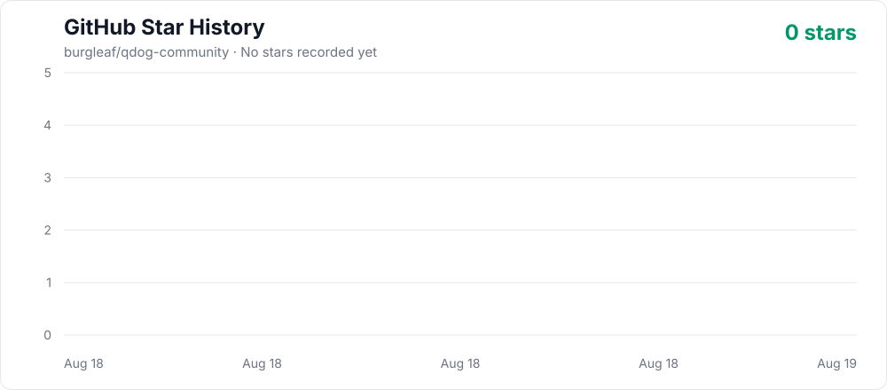

<div align="center">

# QDog

[简体中文](./docs/zh-CN/README.md) | [한국어](./docs/ko/README.md) | [日本語](./docs/ja/README.md) | [Español](./docs/es/README.md) | English

<h2><a href="https://q.dog">Browse and install free community Codex pets at QDog →</a></h2>

<p><strong>QDog is a free community pet gallery.</strong> Browse complete animations like a pet store, install a favorite without cloning the repository, or request a missing character that a community contributor may volunteer to make.</p>

<p><a href="https://q.dog"><strong>Browse pets</strong></a> · <a href="https://q.dog/install"><strong>Install a pet</strong></a> · <a href="https://q.dog/request"><strong>Request a character</strong></a></p>

<a href="https://q.dog"></a>

      [](https://github.com/burgleaf/qdog-community/actions/workflows/pet-previews.yml)

</div>

This repository is the source catalog behind [QDog](https://q.dog): it keeps installable pet packages, creator attribution, collection metadata, validation tools, and contribution history. For browsing and installing pets, start with the website.

## Highlights

- **One-command install** — no clone, no manual setup, works on macOS / Linux / Windows
- **Free community gallery** — complete animation previews, collections, creator profiles, weekly rankings based on installs and likes, sharing, and community statistics at [QDog](https://q.dog)
- **Free character requests** — submit a character and references without making a spritesheet; a community contributor may volunteer to create it, with no delivery guarantee
- **AI-first contributions** — contributors can create, repair, and submit pets with Codex; advanced contributors can still open a PR
- **Open licensing** — code under MIT, pet assets under CC BY-NC 4.0

Each pet is a small shareable package:

```text
pets/<pet-slug>--<author-slug>/
├── submission.json
├── pet.json
└── spritesheet.webp
```

Preview images are generated into `assets/previews/<pet-id>/` as local or CI build output, never inside the pet folder.

Repository-defined series and collections live in `collections.json`. Use `kind: franchise` for pets from the same original work and `kind: theme` for cross-franchise groups connected by a shared subject or style. A pet joins either by listing its slug in `submission.json.collections`; the catalog and website are generated from that metadata. Membership is recorded immediately, while the website publishes a collection only after it has at least three pets.

`submission.json.name` is the required fallback name. Creators may keep a pet single-language by omitting `localized_names`, or opt into bilingual naming by providing both `localized_names.en` and `localized_names.zh`. The website follows the visitor's selected language and never invents a translation.

## Pet Versions

| Version | Atlas                            | Runtime metadata                            | Use                                                   |
| ------- | -------------------------------- | ------------------------------------------- | ----------------------------------------------------- |
| v1      | `1536x1872`, 8 columns × 9 rows  | omit `spriteVersionNumber` or set it to `1` | Existing standard-animation pets                      |
| v2      | `1536x2288`, 8 columns × 11 rows | set `spriteVersionNumber: 2`                | Standard animations plus 16 clockwise look directions |

Both versions remain installable. Use v1 when maintaining an existing 9-row pet; use v2 for newly upgraded pets that need directional looking.

## Quick Install

No clone required. Pick the script for your shell:

```bash
# macOS / Linux
curl -fsSL https://raw.githubusercontent.com/burgleaf/qdog-community/main/scripts/install-pet.sh | bash -s -- firefly--lingxiaotian
```

```powershell
# Windows PowerShell
powershell -NoProfile -ExecutionPolicy Bypass -Command "iwr -UseB https://raw.githubusercontent.com/burgleaf/qdog-community/main/scripts/install-pet.ps1 | iex; Install-CodexPet firefly--lingxiaotian"
```

```bash
# Anywhere with Node.js
npx awesome-codex-pet firefly--lingxiaotian
```

List available pets:

```bash
curl -fsSL https://raw.githubusercontent.com/burgleaf/qdog-community/main/scripts/install-pet.sh | bash -s -- --list
```

Default install locations:

- macOS / Linux: `~/.codex/pets/<pet-id>/`
- Windows: `%USERPROFILE%\.codex\pets\<pet-id>\`

Set `CODEX_HOME` to override, or `AWESOME_CODEX_PET_NO_STATS=1` to opt out of anonymous install counters.

## Upgrade an Existing v1 Pet

1. Open Codex **Settings → Pets**.
2. Find the installed custom pet and choose **Update**.
3. Codex opens a Hatch Pet task. The current v2 workflow validates and preserves the existing 9 animation rows, generates four cardinal anchors plus 16 look directions, then writes an 11-row atlas with `spriteVersionNumber: 2`.
4. Review the generated contact sheet and direction previews before accepting the replacement.

The **Update** action is an AI-assisted v1-to-v2 conversion, not a download notification from this repository. It updates the local package under `~/.codex/pets/`; it does not modify or submit the GitHub copy automatically.

## Pets

### Game Characters

<table>
<tr><th>Name</th><td colspan="5"><strong>★ Featured pet</strong> · <a href="https://q.dog/pets/firefly--lingxiaotian">Firefly</a> · Author: <a href="https://github.com/legeling">@legeling</a> · Category: Game Characters · Version: v1</td></tr>
<tr><th>Install</th><td colspan="5"><code>curl -fsSL https://raw.githubusercontent.com/burgleaf/qdog-community/main/scripts/install-pet.sh | bash -s -- firefly--lingxiaotian</code></td></tr>
<tr><th>Action</th><td><strong>Idle</strong></td><td><strong>Waving</strong></td><td><strong>Running</strong></td><td><strong>Waiting</strong></td><td><strong>Review</strong></td></tr>
<tr><th>Preview</th><td></td><td></td><td></td><td></td><td></td></tr>
<tr><th>View all actions</th><td colspan="5"><a href="https://q.dog/pets/firefly--lingxiaotian">View all actions →</a></td></tr>
</table>

<table>
<tr><td width="180" align="center"><a href="https://q.dog/pets/acheron--lingxiaotian"></a></td><td valign="top"><strong><a href="https://q.dog/pets/acheron--lingxiaotian">Acheron</a></strong><br>Author: <a href="https://github.com/legeling">@legeling</a> · Category: Game Characters · Version: v1<br><br><strong>Install</strong><br><code>curl -fsSL https://raw.githubusercontent.com/burgleaf/qdog-community/main/scripts/install-pet.sh | bash -s -- acheron--lingxiaotian</code><br><br><a href="https://q.dog/pets/acheron--lingxiaotian">View all actions →</a></td></tr>
</table>

<table>
<tr><td valign="top"><strong><a href="https://q.dog/pets/aggron-3d--dnnyngyen">Aggron (3D)</a></strong><br>Author: <a href="https://github.com/dnnyngyen">@dnnyngyen</a> · Category: Game Characters · Version: v1<br><br><strong>Install</strong><br><code>curl -fsSL https://raw.githubusercontent.com/burgleaf/qdog-community/main/scripts/install-pet.sh | bash -s -- aggron-3d--dnnyngyen</code><br><br><a href="https://q.dog/pets/aggron-3d--dnnyngyen">View all actions →</a></td><td width="180" align="center"><a href="https://q.dog/pets/aggron-3d--dnnyngyen"></a></td></tr>
</table>

<table>
<tr><td width="180" align="center"><a href="https://q.dog/pets/arlecchino--lingxiaotian"></a></td><td valign="top"><strong><a href="https://q.dog/pets/arlecchino--lingxiaotian">Arlecchino</a></strong><br>Author: <a href="https://github.com/legeling">@legeling</a> · Category: Game Characters · Version: v1<br><br><strong>Install</strong><br><code>curl -fsSL https://raw.githubusercontent.com/burgleaf/qdog-community/main/scripts/install-pet.sh | bash -s -- arlecchino--lingxiaotian</code><br><br><a href="https://q.dog/pets/arlecchino--lingxiaotian">View all actions →</a></td></tr>
</table>

<table>
<tr><td valign="top"><strong><a href="https://q.dog/pets/barboach-3d--dnnyngyen">Barboach (3D)</a></strong><br>Author: <a href="https://github.com/dnnyngyen">@dnnyngyen</a> · Category: Game Characters · Version: v1<br><br><strong>Install</strong><br><code>curl -fsSL https://raw.githubusercontent.com/burgleaf/qdog-community/main/scripts/install-pet.sh | bash -s -- barboach-3d--dnnyngyen</code><br><br><a href="https://q.dog/pets/barboach-3d--dnnyngyen">View all actions →</a></td><td width="180" align="center"><a href="https://q.dog/pets/barboach-3d--dnnyngyen"></a></td></tr>
</table>

<table>
<tr><td width="180" align="center"><a href="https://q.dog/pets/black-swan--lingxiaotian"></a></td><td valign="top"><strong><a href="https://q.dog/pets/black-swan--lingxiaotian">Black Swan</a></strong><br>Author: <a href="https://github.com/legeling">@legeling</a> · Category: Game Characters · Version: v1<br><br><strong>Install</strong><br><code>curl -fsSL https://raw.githubusercontent.com/burgleaf/qdog-community/main/scripts/install-pet.sh | bash -s -- black-swan--lingxiaotian</code><br><br><a href="https://q.dog/pets/black-swan--lingxiaotian">View all actions →</a></td></tr>
</table>

<table>
<tr><td valign="top"><strong><a href="https://q.dog/pets/buba--yurcek">Buba</a></strong><br>Author: @yurcek · Category: Game Characters · Version: v1<br><br><strong>Install</strong><br><code>curl -fsSL https://raw.githubusercontent.com/burgleaf/qdog-community/main/scripts/install-pet.sh | bash -s -- buba--yurcek</code><br><br><a href="https://q.dog/pets/buba--yurcek">View all actions →</a></td><td width="180" align="center"><a href="https://q.dog/pets/buba--yurcek"></a></td></tr>
</table>

<table>
<tr><td width="180" align="center"><a href="https://q.dog/pets/castorice--lingxiaotian"></a></td><td valign="top"><strong><a href="https://q.dog/pets/castorice--lingxiaotian">Castorice</a></strong><br>Author: <a href="https://github.com/legeling">@legeling</a> · Category: Game Characters · Version: v1<br><br><strong>Install</strong><br><code>curl -fsSL https://raw.githubusercontent.com/burgleaf/qdog-community/main/scripts/install-pet.sh | bash -s -- castorice--lingxiaotian</code><br><br><a href="https://q.dog/pets/castorice--lingxiaotian">View all actions →</a></td></tr>
</table>

<table>
<tr><td valign="top"><strong><a href="https://q.dog/pets/charizard--dnnyngyen">Charizard</a></strong><br>Author: <a href="https://github.com/dnnyngyen">@dnnyngyen</a> · Category: Game Characters · Version: v1<br><br><strong>Install</strong><br><code>curl -fsSL https://raw.githubusercontent.com/burgleaf/qdog-community/main/scripts/install-pet.sh | bash -s -- charizard--dnnyngyen</code><br><br><a href="https://q.dog/pets/charizard--dnnyngyen">View all actions →</a></td><td width="180" align="center"><a href="https://q.dog/pets/charizard--dnnyngyen"></a></td></tr>
</table>

<table>
<tr><td width="180" align="center"><a href="https://q.dog/pets/chen--chenxin-dlut"></a></td><td valign="top"><strong><a href="https://q.dog/pets/chen--chenxin-dlut">Ch'en</a></strong><br>Author: <a href="https://github.com/chenxin-dlut">@chenxin-dlut</a> · Category: Game Characters · Version: v1<br><br><strong>Install</strong><br><code>curl -fsSL https://raw.githubusercontent.com/burgleaf/qdog-community/main/scripts/install-pet.sh | bash -s -- chen--chenxin-dlut</code><br><br><a href="https://q.dog/pets/chen--chenxin-dlut">View all actions →</a></td></tr>
</table>

<table>
<tr><td valign="top"><strong><a href="https://q.dog/pets/cyrene--lingxiaotian">Cyrene</a></strong><br>Author: <a href="https://github.com/legeling">@legeling</a> · Category: Game Characters · Version: v1<br><br><strong>Install</strong><br><code>curl -fsSL https://raw.githubusercontent.com/burgleaf/qdog-community/main/scripts/install-pet.sh | bash -s -- cyrene--lingxiaotian</code><br><br><a href="https://q.dog/pets/cyrene--lingxiaotian">View all actions →</a></td><td width="180" align="center"><a href="https://q.dog/pets/cyrene--lingxiaotian"></a></td></tr>
</table>

<table>
<tr><td width="180" align="center"><a href="https://q.dog/pets/dimo-stand--god-wu"></a></td><td valign="top"><strong><a href="https://q.dog/pets/dimo-stand--god-wu">Dimo</a></strong><br>Author: @god-wu · Category: Game Characters · Version: v1<br><br><strong>Install</strong><br><code>curl -fsSL https://raw.githubusercontent.com/burgleaf/qdog-community/main/scripts/install-pet.sh | bash -s -- dimo-stand--god-wu</code><br><br><a href="https://q.dog/pets/dimo-stand--god-wu">View all actions →</a></td></tr>
</table>

<table>
<tr><td valign="top"><strong><a href="https://q.dog/pets/doro--lingxiaotian">Doro</a></strong><br>Author: <a href="https://github.com/legeling">@legeling</a> · Category: Game Characters · Version: v1<br><br><strong>Install</strong><br><code>curl -fsSL https://raw.githubusercontent.com/burgleaf/qdog-community/main/scripts/install-pet.sh | bash -s -- doro--lingxiaotian</code><br><br><a href="https://q.dog/pets/doro--lingxiaotian">View all actions →</a></td><td width="180" align="center"><a href="https://q.dog/pets/doro--lingxiaotian"></a></td></tr>
</table>

<table>
<tr><td width="180" align="center"><a href="https://q.dog/pets/eevee--dnnyngyen"></a></td><td valign="top"><strong><a href="https://q.dog/pets/eevee--dnnyngyen">Eevee</a></strong><br>Author: <a href="https://github.com/dnnyngyen">@dnnyngyen</a> · Category: Game Characters · Version: v1<br><br><strong>Install</strong><br><code>curl -fsSL https://raw.githubusercontent.com/burgleaf/qdog-community/main/scripts/install-pet.sh | bash -s -- eevee--dnnyngyen</code><br><br><a href="https://q.dog/pets/eevee--dnnyngyen">View all actions →</a></td></tr>
</table>

<table>
<tr><td valign="top"><strong><a href="https://q.dog/pets/feixiao--lingxiaotian">Feixiao</a></strong><br>Author: <a href="https://github.com/legeling">@legeling</a> · Category: Game Characters · Version: v1<br><br><strong>Install</strong><br><code>curl -fsSL https://raw.githubusercontent.com/burgleaf/qdog-community/main/scripts/install-pet.sh | bash -s -- feixiao--lingxiaotian</code><br><br><a href="https://q.dog/pets/feixiao--lingxiaotian">View all actions →</a></td><td width="180" align="center"><a href="https://q.dog/pets/feixiao--lingxiaotian"></a></td></tr>
</table>

<table>
<tr><td width="180" align="center"><a href="https://q.dog/pets/furina--lingxiaotian"></a></td><td valign="top"><strong><a href="https://q.dog/pets/furina--lingxiaotian">Furina</a></strong><br>Author: <a href="https://github.com/legeling">@legeling</a> · Category: Game Characters · Version: v1<br><br><strong>Install</strong><br><code>curl -fsSL https://raw.githubusercontent.com/burgleaf/qdog-community/main/scripts/install-pet.sh | bash -s -- furina--lingxiaotian</code><br><br><a href="https://q.dog/pets/furina--lingxiaotian">View all actions →</a></td></tr>
</table>

<table>
<tr><td valign="top"><strong><a href="https://q.dog/pets/ganyu--chenxin-dlut">Ganyu</a></strong><br>Author: <a href="https://github.com/chenxin-dlut">@chenxin-dlut</a> · Category: Game Characters · Version: v1<br><br><strong>Install</strong><br><code>curl -fsSL https://raw.githubusercontent.com/burgleaf/qdog-community/main/scripts/install-pet.sh | bash -s -- ganyu--chenxin-dlut</code><br><br><a href="https://q.dog/pets/ganyu--chenxin-dlut">View all actions →</a></td><td width="180" align="center"><a href="https://q.dog/pets/ganyu--chenxin-dlut"></a></td></tr>
</table>

<table>
<tr><td width="180" align="center"><a href="https://q.dog/pets/hu-tao--lingxiaotian"></a></td><td valign="top"><strong><a href="https://q.dog/pets/hu-tao--lingxiaotian">Hu Tao</a></strong><br>Author: <a href="https://github.com/legeling">@legeling</a> · Category: Game Characters · Version: v1<br><br><strong>Install</strong><br><code>curl -fsSL https://raw.githubusercontent.com/burgleaf/qdog-community/main/scripts/install-pet.sh | bash -s -- hu-tao--lingxiaotian</code><br><br><a href="https://q.dog/pets/hu-tao--lingxiaotian">View all actions →</a></td></tr>
</table>

<table>
<tr><td valign="top"><strong><a href="https://q.dog/pets/hyacine--kurisu">Hyacine</a></strong><br>Author: <a href="https://github.com/kurisu994">@kurisu994</a> · Category: Game Characters · Version: v2<br><br><strong>Install</strong><br><code>curl -fsSL https://raw.githubusercontent.com/burgleaf/qdog-community/main/scripts/install-pet.sh | bash -s -- hyacine--kurisu</code><br><br><a href="https://q.dog/pets/hyacine--kurisu">View all actions →</a></td><td width="180" align="center"><a href="https://q.dog/pets/hyacine--kurisu"></a></td></tr>
</table>

<table>
<tr><td width="180" align="center"><a href="https://q.dog/pets/isaac--foggy-whale"></a></td><td valign="top"><strong><a href="https://q.dog/pets/isaac--foggy-whale">Isaac</a></strong><br>Author: <a href="https://github.com/Foggy-whale">@Foggy-whale</a> · Category: Game Characters · Version: v2<br><br><strong>Install</strong><br><code>curl -fsSL https://raw.githubusercontent.com/burgleaf/qdog-community/main/scripts/install-pet.sh | bash -s -- isaac--foggy-whale</code><br><br><a href="https://q.dog/pets/isaac--foggy-whale">View all actions →</a></td></tr>
</table>

<table>
<tr><td valign="top"><strong><a href="https://q.dog/pets/kamisato-ayaka--lingxiaotian">Kamisato Ayaka</a></strong><br>Author: <a href="https://github.com/legeling">@legeling</a> · Category: Game Characters · Version: v1<br><br><strong>Install</strong><br><code>curl -fsSL https://raw.githubusercontent.com/burgleaf/qdog-community/main/scripts/install-pet.sh | bash -s -- kamisato-ayaka--lingxiaotian</code><br><br><a href="https://q.dog/pets/kamisato-ayaka--lingxiaotian">View all actions →</a></td><td width="180" align="center"><a href="https://q.dog/pets/kamisato-ayaka--lingxiaotian"></a></td></tr>
</table>

<table>
<tr><td width="180" align="center"><a href="https://q.dog/pets/klee--chenxin-dlut"></a></td><td valign="top"><strong><a href="https://q.dog/pets/klee--chenxin-dlut">Klee</a></strong><br>Author: <a href="https://github.com/chenxin-dlut">@chenxin-dlut</a> · Category: Game Characters · Version: v1<br><br><strong>Install</strong><br><code>curl -fsSL https://raw.githubusercontent.com/burgleaf/qdog-community/main/scripts/install-pet.sh | bash -s -- klee--chenxin-dlut</code><br><br><a href="https://q.dog/pets/klee--chenxin-dlut">View all actions →</a></td></tr>
</table>

<table>
<tr><td valign="top"><strong><a href="https://q.dog/pets/kuro-chibi--kuroneko-night">Kuro Chibi</a></strong><br>Author: <a href="https://github.com/KuroNeko-night">@KuroNeko-night</a> · Category: Game Characters · Version: v2<br><br><strong>Install</strong><br><code>curl -fsSL https://raw.githubusercontent.com/burgleaf/qdog-community/main/scripts/install-pet.sh | bash -s -- kuro-chibi--kuroneko-night</code><br><br><a href="https://q.dog/pets/kuro-chibi--kuroneko-night">View all actions →</a></td><td width="180" align="center"><a href="https://q.dog/pets/kuro-chibi--kuroneko-night"></a></td></tr>
</table>

<table>
<tr><td width="180" align="center"><a href="https://q.dog/pets/lappland--chenxin-dlut"></a></td><td valign="top"><strong><a href="https://q.dog/pets/lappland--chenxin-dlut">Lappland</a></strong><br>Author: <a href="https://github.com/chenxin-dlut">@chenxin-dlut</a> · Category: Game Characters · Version: v1<br><br><strong>Install</strong><br><code>curl -fsSL https://raw.githubusercontent.com/burgleaf/qdog-community/main/scripts/install-pet.sh | bash -s -- lappland--chenxin-dlut</code><br><br><a href="https://q.dog/pets/lappland--chenxin-dlut">View all actions →</a></td></tr>
</table>

<table>
<tr><td valign="top"><strong><a href="https://q.dog/pets/little-black-mage--libertis">Little Black Mage</a></strong><br>Author: @libertis · Category: Game Characters · Version: v1<br><br><strong>Install</strong><br><code>curl -fsSL https://raw.githubusercontent.com/burgleaf/qdog-community/main/scripts/install-pet.sh | bash -s -- little-black-mage--libertis</code><br><br><a href="https://q.dog/pets/little-black-mage--libertis">View all actions →</a></td><td width="180" align="center"><a href="https://q.dog/pets/little-black-mage--libertis"></a></td></tr>
</table>

<table>
<tr><td width="180" align="center"><a href="https://q.dog/pets/march-7th--chenxin-dlut"></a></td><td valign="top"><strong><a href="https://q.dog/pets/march-7th--chenxin-dlut">March 7th</a></strong><br>Author: <a href="https://github.com/chenxin-dlut">@chenxin-dlut</a> · Category: Game Characters · Version: v1<br><br><strong>Install</strong><br><code>curl -fsSL https://raw.githubusercontent.com/burgleaf/qdog-community/main/scripts/install-pet.sh | bash -s -- march-7th--chenxin-dlut</code><br><br><a href="https://q.dog/pets/march-7th--chenxin-dlut">View all actions →</a></td></tr>
</table>

<table>
<tr><td valign="top"><strong><a href="https://q.dog/pets/miyabi--eric-terminal">Miyabi</a></strong><br>Author: <a href="https://codex-pets.net/users/eric-terminal">@eric-terminal</a> · Category: Game Characters · Version: v1<br><br><strong>Install</strong><br><code>curl -fsSL https://raw.githubusercontent.com/burgleaf/qdog-community/main/scripts/install-pet.sh | bash -s -- miyabi--eric-terminal</code><br><br><a href="https://q.dog/pets/miyabi--eric-terminal">View all actions →</a></td><td width="180" align="center"><a href="https://q.dog/pets/miyabi--eric-terminal"></a></td></tr>
</table>

<table>
<tr><td width="180" align="center"><a href="https://q.dog/pets/nahida--lingxiaotian"></a></td><td valign="top"><strong><a href="https://q.dog/pets/nahida--lingxiaotian">Nahida</a></strong><br>Author: <a href="https://github.com/legeling">@legeling</a> · Category: Game Characters · Version: v1<br><br><strong>Install</strong><br><code>curl -fsSL https://raw.githubusercontent.com/burgleaf/qdog-community/main/scripts/install-pet.sh | bash -s -- nahida--lingxiaotian</code><br><br><a href="https://q.dog/pets/nahida--lingxiaotian">View all actions →</a></td></tr>
</table>

<table>
<tr><td valign="top"><strong><a href="https://q.dog/pets/navia--lingxiaotian">Navia</a></strong><br>Author: <a href="https://github.com/legeling">@legeling</a> · Category: Game Characters · Version: v1<br><br><strong>Install</strong><br><code>curl -fsSL https://raw.githubusercontent.com/burgleaf/qdog-community/main/scripts/install-pet.sh | bash -s -- navia--lingxiaotian</code><br><br><a href="https://q.dog/pets/navia--lingxiaotian">View all actions →</a></td><td width="180" align="center"><a href="https://q.dog/pets/navia--lingxiaotian"></a></td></tr>
</table>

<table>
<tr><td width="180" align="center"><a href="https://q.dog/pets/paimon--lingxiaotian"></a></td><td valign="top"><strong><a href="https://q.dog/pets/paimon--lingxiaotian">Paimon</a></strong><br>Author: <a href="https://github.com/legeling">@legeling</a> · Category: Game Characters · Version: v1<br><br><strong>Install</strong><br><code>curl -fsSL https://raw.githubusercontent.com/burgleaf/qdog-community/main/scripts/install-pet.sh | bash -s -- paimon--lingxiaotian</code><br><br><a href="https://q.dog/pets/paimon--lingxiaotian">View all actions →</a></td></tr>
</table>

<table>
<tr><td valign="top"><strong><a href="https://q.dog/pets/phoebe--chenxin-dlut">Phoebe</a></strong><br>Author: <a href="https://github.com/chenxin-dlut">@chenxin-dlut</a> · Category: Game Characters · Version: v1<br><br><strong>Install</strong><br><code>curl -fsSL https://raw.githubusercontent.com/burgleaf/qdog-community/main/scripts/install-pet.sh | bash -s -- phoebe--chenxin-dlut</code><br><br><a href="https://q.dog/pets/phoebe--chenxin-dlut">View all actions →</a></td><td width="180" align="center"><a href="https://q.dog/pets/phoebe--chenxin-dlut"></a></td></tr>
</table>

<table>
<tr><td width="180" align="center"><a href="https://q.dog/pets/pikachu--dnnyngyen"></a></td><td valign="top"><strong><a href="https://q.dog/pets/pikachu--dnnyngyen">Pikachu</a></strong><br>Author: <a href="https://github.com/dnnyngyen">@dnnyngyen</a> · Category: Game Characters · Version: v1<br><br><strong>Install</strong><br><code>curl -fsSL https://raw.githubusercontent.com/burgleaf/qdog-community/main/scripts/install-pet.sh | bash -s -- pikachu--dnnyngyen</code><br><br><a href="https://q.dog/pets/pikachu--dnnyngyen">View all actions →</a></td></tr>
</table>

<table>
<tr><td valign="top"><strong><a href="https://q.dog/pets/raiden-shogun--lingxiaotian">Raiden Shogun</a></strong><br>Author: <a href="https://github.com/legeling">@legeling</a> · Category: Game Characters · Version: v1<br><br><strong>Install</strong><br><code>curl -fsSL https://raw.githubusercontent.com/burgleaf/qdog-community/main/scripts/install-pet.sh | bash -s -- raiden-shogun--lingxiaotian</code><br><br><a href="https://q.dog/pets/raiden-shogun--lingxiaotian">View all actions →</a></td><td width="180" align="center"><a href="https://q.dog/pets/raiden-shogun--lingxiaotian"></a></td></tr>
</table>

<table>
<tr><td width="180" align="center"><a href="https://q.dog/pets/reimu--lingxiaotian"></a></td><td valign="top"><strong><a href="https://q.dog/pets/reimu--lingxiaotian">Reimu</a></strong><br>Author: <a href="https://github.com/legeling">@legeling</a> · Category: Game Characters · Version: v1<br><br><strong>Install</strong><br><code>curl -fsSL https://raw.githubusercontent.com/burgleaf/qdog-community/main/scripts/install-pet.sh | bash -s -- reimu--lingxiaotian</code><br><br><a href="https://q.dog/pets/reimu--lingxiaotian">View all actions →</a></td></tr>
</table>

<table>
<tr><td valign="top"><strong><a href="https://q.dog/pets/remielle-dan--erlla">Remielle-Dan / Leimi</a></strong><br>Author: <a href="https://github.com/Erlla">@Erlla</a> · Category: Game Characters · Version: v2<br><br><strong>Install</strong><br><code>curl -fsSL https://raw.githubusercontent.com/burgleaf/qdog-community/main/scripts/install-pet.sh | bash -s -- remielle-dan--erlla</code><br><br><a href="https://q.dog/pets/remielle-dan--erlla">View all actions →</a></td><td width="180" align="center"><a href="https://q.dog/pets/remielle-dan--erlla"></a></td></tr>
</table>

<table>
<tr><td width="180" align="center"><a href="https://q.dog/pets/robin--lingxiaotian"></a></td><td valign="top"><strong><a href="https://q.dog/pets/robin--lingxiaotian">Robin</a></strong><br>Author: <a href="https://github.com/legeling">@legeling</a> · Category: Game Characters · Version: v1<br><br><strong>Install</strong><br><code>curl -fsSL https://raw.githubusercontent.com/burgleaf/qdog-community/main/scripts/install-pet.sh | bash -s -- robin--lingxiaotian</code><br><br><a href="https://q.dog/pets/robin--lingxiaotian">View all actions →</a></td></tr>
</table>

<table>
<tr><td valign="top"><strong><a href="https://q.dog/pets/ruan-mei--lingxiaotian">Ruan Mei</a></strong><br>Author: <a href="https://github.com/legeling">@legeling</a> · Category: Game Characters · Version: v1<br><br><strong>Install</strong><br><code>curl -fsSL https://raw.githubusercontent.com/burgleaf/qdog-community/main/scripts/install-pet.sh | bash -s -- ruan-mei--lingxiaotian</code><br><br><a href="https://q.dog/pets/ruan-mei--lingxiaotian">View all actions →</a></td><td width="180" align="center"><a href="https://q.dog/pets/ruan-mei--lingxiaotian"></a></td></tr>
</table>

<table>
<tr><td width="180" align="center"><a href="https://q.dog/pets/silver-wolf--lingxiaotian"></a></td><td valign="top"><strong><a href="https://q.dog/pets/silver-wolf--lingxiaotian">Silver Wolf</a></strong><br>Author: <a href="https://github.com/legeling">@legeling</a> · Category: Game Characters · Version: v1<br><br><strong>Install</strong><br><code>curl -fsSL https://raw.githubusercontent.com/burgleaf/qdog-community/main/scripts/install-pet.sh | bash -s -- silver-wolf--lingxiaotian</code><br><br><a href="https://q.dog/pets/silver-wolf--lingxiaotian">View all actions →</a></td></tr>
</table>

<table>
<tr><td valign="top"><strong><a href="https://q.dog/pets/sonetto--chenxin-dlut">Sonetto</a></strong><br>Author: <a href="https://github.com/chenxin-dlut">@chenxin-dlut</a> · Category: Game Characters · Version: v1<br><br><strong>Install</strong><br><code>curl -fsSL https://raw.githubusercontent.com/burgleaf/qdog-community/main/scripts/install-pet.sh | bash -s -- sonetto--chenxin-dlut</code><br><br><a href="https://q.dog/pets/sonetto--chenxin-dlut">View all actions →</a></td><td width="180" align="center"><a href="https://q.dog/pets/sonetto--chenxin-dlut"></a></td></tr>
</table>

<table>
<tr><td width="180" align="center"><a href="https://q.dog/pets/sparkle--lingxiaotian"></a></td><td valign="top"><strong><a href="https://q.dog/pets/sparkle--lingxiaotian">Sparkle</a></strong><br>Author: <a href="https://github.com/legeling">@legeling</a> · Category: Game Characters · Version: v1<br><br><strong>Install</strong><br><code>curl -fsSL https://raw.githubusercontent.com/burgleaf/qdog-community/main/scripts/install-pet.sh | bash -s -- sparkle--lingxiaotian</code><br><br><a href="https://q.dog/pets/sparkle--lingxiaotian">View all actions →</a></td></tr>
</table>

<table>
<tr><td valign="top"><strong><a href="https://q.dog/pets/susuta--xiangzi529">Susuta</a></strong><br>Author: <a href="https://github.com/Xiangzi529">@Xiangzi529</a> · Category: Game Characters · Version: v2<br><br><strong>Install</strong><br><code>curl -fsSL https://raw.githubusercontent.com/burgleaf/qdog-community/main/scripts/install-pet.sh | bash -s -- susuta--xiangzi529</code><br><br><a href="https://q.dog/pets/susuta--xiangzi529">View all actions →</a></td><td width="180" align="center"><a href="https://q.dog/pets/susuta--xiangzi529"></a></td></tr>
</table>

<table>
<tr><td width="180" align="center"><a href="https://q.dog/pets/tingyun--lingxiaotian"></a></td><td valign="top"><strong><a href="https://q.dog/pets/tingyun--lingxiaotian">Tingyun</a></strong><br>Author: <a href="https://github.com/legeling">@legeling</a> · Category: Game Characters · Version: v1<br><br><strong>Install</strong><br><code>curl -fsSL https://raw.githubusercontent.com/burgleaf/qdog-community/main/scripts/install-pet.sh | bash -s -- tingyun--lingxiaotian</code><br><br><a href="https://q.dog/pets/tingyun--lingxiaotian">View all actions →</a></td></tr>
</table>

<table>
<tr><td valign="top"><strong><a href="https://q.dog/pets/vertin--chenxin-dlut">Vertin</a></strong><br>Author: <a href="https://github.com/chenxin-dlut">@chenxin-dlut</a> · Category: Game Characters · Version: v1<br><br><strong>Install</strong><br><code>curl -fsSL https://raw.githubusercontent.com/burgleaf/qdog-community/main/scripts/install-pet.sh | bash -s -- vertin--chenxin-dlut</code><br><br><a href="https://q.dog/pets/vertin--chenxin-dlut">View all actions →</a></td><td width="180" align="center"><a href="https://q.dog/pets/vertin--chenxin-dlut"></a></td></tr>
</table>

<table>
<tr><td width="180" align="center"><a href="https://q.dog/pets/yoimiya--chenxin-dlut"></a></td><td valign="top"><strong><a href="https://q.dog/pets/yoimiya--chenxin-dlut">Yoimiya</a></strong><br>Author: <a href="https://github.com/chenxin-dlut">@chenxin-dlut</a> · Category: Game Characters · Version: v1<br><br><strong>Install</strong><br><code>curl -fsSL https://raw.githubusercontent.com/burgleaf/qdog-community/main/scripts/install-pet.sh | bash -s -- yoimiya--chenxin-dlut</code><br><br><a href="https://q.dog/pets/yoimiya--chenxin-dlut">View all actions →</a></td></tr>
</table>

<table>
<tr><td valign="top"><strong><a href="https://q.dog/pets/zani--chenxin-dlut">Zani</a></strong><br>Author: <a href="https://github.com/chenxin-dlut">@chenxin-dlut</a> · Category: Game Characters · Version: v1<br><br><strong>Install</strong><br><code>curl -fsSL https://raw.githubusercontent.com/burgleaf/qdog-community/main/scripts/install-pet.sh | bash -s -- zani--chenxin-dlut</code><br><br><a href="https://q.dog/pets/zani--chenxin-dlut">View all actions →</a></td><td width="180" align="center"><a href="https://q.dog/pets/zani--chenxin-dlut"></a></td></tr>
</table>

<table>
<tr><td width="180" align="center"><a href="https://q.dog/pets/yae-miko--legeling"></a></td><td valign="top"><strong><a href="https://q.dog/pets/yae-miko--legeling">Yae Miko</a></strong><br>Author: <a href="https://github.com/legeling">@legeling</a> · Category: Game Characters · Version: v2<br><br><strong>Install</strong><br><code>curl -fsSL https://raw.githubusercontent.com/burgleaf/qdog-community/main/scripts/install-pet.sh | bash -s -- yae-miko--legeling</code><br><br><a href="https://q.dog/pets/yae-miko--legeling">View all actions →</a></td></tr>
</table>

<table>
<tr><td valign="top"><strong><a href="https://q.dog/pets/dnf-female-ammo--qunboo">女弹药Q</a></strong><br>Author: <a href="https://github.com/QunBoo">@QunBoo</a> · Category: Game Characters · Version: v1<br><br><strong>Install</strong><br><code>curl -fsSL https://raw.githubusercontent.com/burgleaf/qdog-community/main/scripts/install-pet.sh | bash -s -- dnf-female-ammo--qunboo</code><br><br><a href="https://q.dog/pets/dnf-female-ammo--qunboo">View all actions →</a></td><td width="180" align="center"><a href="https://q.dog/pets/dnf-female-ammo--qunboo"></a></td></tr>
</table>

<table>
<tr><td width="180" align="center"><a href="https://q.dog/pets/new-covenant-exusiai--chenxin-dlut"></a></td><td valign="top"><strong><a href="https://q.dog/pets/new-covenant-exusiai--chenxin-dlut">Exusiai the New Covenant</a></strong><br>Author: <a href="https://github.com/chenxin-dlut">@chenxin-dlut</a> · Category: Game Characters · Version: v1<br><br><strong>Install</strong><br><code>curl -fsSL https://raw.githubusercontent.com/burgleaf/qdog-community/main/scripts/install-pet.sh | bash -s -- new-covenant-exusiai--chenxin-dlut</code><br><br><a href="https://q.dog/pets/new-covenant-exusiai--chenxin-dlut">View all actions →</a></td></tr>
</table>

<table>
<tr><td valign="top"><strong><a href="https://q.dog/pets/regulus-star-antimony--chenxin-dlut">Regulus</a></strong><br>Author: <a href="https://github.com/chenxin-dlut">@chenxin-dlut</a> · Category: Game Characters · Version: v1<br><br><strong>Install</strong><br><code>curl -fsSL https://raw.githubusercontent.com/burgleaf/qdog-community/main/scripts/install-pet.sh | bash -s -- regulus-star-antimony--chenxin-dlut</code><br><br><a href="https://q.dog/pets/regulus-star-antimony--chenxin-dlut">View all actions →</a></td><td width="180" align="center"><a href="https://q.dog/pets/regulus-star-antimony--chenxin-dlut"></a></td></tr>
</table>

<table>
<tr><td width="180" align="center"><a href="https://q.dog/pets/youmu--ai-generated"></a></td><td valign="top"><strong><a href="https://q.dog/pets/youmu--ai-generated">魂魄妖梦</a></strong><br>Author: @ai-generated · Category: Game Characters · Version: v2<br><br><strong>Install</strong><br><code>curl -fsSL https://raw.githubusercontent.com/burgleaf/qdog-community/main/scripts/install-pet.sh | bash -s -- youmu--ai-generated</code><br><br><a href="https://q.dog/pets/youmu--ai-generated">View all actions →</a></td></tr>
</table>

### Anime Characters

<table>
<tr><td valign="top"><strong><a href="https://q.dog/pets/zero-two--mingqingmozhao">Zero Two</a></strong><br>Author: @mingqingmozhao · Category: Anime Characters · Version: v1<br><br><strong>Install</strong><br><code>curl -fsSL https://raw.githubusercontent.com/burgleaf/qdog-community/main/scripts/install-pet.sh | bash -s -- zero-two--mingqingmozhao</code><br><br><a href="https://q.dog/pets/zero-two--mingqingmozhao">View all actions →</a></td><td width="180" align="center"><a href="https://q.dog/pets/zero-two--mingqingmozhao"></a></td></tr>
</table>

<table>
<tr><td width="180" align="center"><a href="https://q.dog/pets/anya--chenxin-dlut"></a></td><td valign="top"><strong><a href="https://q.dog/pets/anya--chenxin-dlut">Anya</a></strong><br>Author: <a href="https://github.com/chenxin-dlut">@chenxin-dlut</a> · Category: Anime Characters · Version: v1<br><br><strong>Install</strong><br><code>curl -fsSL https://raw.githubusercontent.com/burgleaf/qdog-community/main/scripts/install-pet.sh | bash -s -- anya--chenxin-dlut</code><br><br><a href="https://q.dog/pets/anya--chenxin-dlut">View all actions →</a></td></tr>
</table>

<table>
<tr><td valign="top"><strong><a href="https://q.dog/pets/asuka--maxg24">Asuka</a></strong><br>Author: <a href="https://codex-pets.net/users/maxg24">@maxg24</a> · Category: Anime Characters · Version: v1<br><br><strong>Install</strong><br><code>curl -fsSL https://raw.githubusercontent.com/burgleaf/qdog-community/main/scripts/install-pet.sh | bash -s -- asuka--maxg24</code><br><br><a href="https://q.dog/pets/asuka--maxg24">View all actions →</a></td><td width="180" align="center"><a href="https://q.dog/pets/asuka--maxg24"></a></td></tr>
</table>

<table>
<tr><td width="180" align="center"><a href="https://q.dog/pets/chibi-rei-pet--bendy"></a></td><td valign="top"><strong><a href="https://q.dog/pets/chibi-rei-pet--bendy">Rei Ayanami</a></strong><br>Author: @Bendy · Category: Anime Characters · Version: v1<br><br><strong>Install</strong><br><code>curl -fsSL https://raw.githubusercontent.com/burgleaf/qdog-community/main/scripts/install-pet.sh | bash -s -- chibi-rei-pet--bendy</code><br><br><a href="https://q.dog/pets/chibi-rei-pet--bendy">View all actions →</a></td></tr>
</table>

<table>
<tr><td valign="top"><strong><a href="https://q.dog/pets/chotu--makriman">Chotu</a></strong><br>Author: <a href="https://github.com/makriman">@makriman</a> · Category: Anime Characters · Version: v2<br><br><strong>Install</strong><br><code>curl -fsSL https://raw.githubusercontent.com/burgleaf/qdog-community/main/scripts/install-pet.sh | bash -s -- chotu--makriman</code><br><br><a href="https://q.dog/pets/chotu--makriman">View all actions →</a></td><td width="180" align="center"><a href="https://q.dog/pets/chotu--makriman"></a></td></tr>
</table>

<table>
<tr><td width="180" align="center"><a href="https://q.dog/pets/conan--chenxin-dlut"></a></td><td valign="top"><strong><a href="https://q.dog/pets/conan--chenxin-dlut">Conan Edogawa</a></strong><br>Author: <a href="https://github.com/chenxin-dlut">@chenxin-dlut</a> · Category: Anime Characters · Version: v1<br><br><strong>Install</strong><br><code>curl -fsSL https://raw.githubusercontent.com/burgleaf/qdog-community/main/scripts/install-pet.sh | bash -s -- conan--chenxin-dlut</code><br><br><a href="https://q.dog/pets/conan--chenxin-dlut">View all actions →</a></td></tr>
</table>

<table>
<tr><td valign="top"><strong><a href="https://q.dog/pets/doraemon--xueshi">Doraemon</a></strong><br>Author: <a href="https://codex-pets.net/users/xueshi">@xueshi</a> · Category: Anime Characters · Version: v1<br><br><strong>Install</strong><br><code>curl -fsSL https://raw.githubusercontent.com/burgleaf/qdog-community/main/scripts/install-pet.sh | bash -s -- doraemon--xueshi</code><br><br><a href="https://q.dog/pets/doraemon--xueshi">View all actions →</a></td><td width="180" align="center"><a href="https://q.dog/pets/doraemon--xueshi"></a></td></tr>
</table>

<table>
<tr><td width="180" align="center"><a href="https://q.dog/pets/elaina--nyakku-shigure"></a></td><td valign="top"><strong><a href="https://q.dog/pets/elaina--nyakku-shigure">Elaina</a></strong><br>Author: <a href="https://codex-pets.net/users/nyakku-shigure">@nyakku-shigure</a> · Category: Anime Characters · Version: v1<br><br><strong>Install</strong><br><code>curl -fsSL https://raw.githubusercontent.com/burgleaf/qdog-community/main/scripts/install-pet.sh | bash -s -- elaina--nyakku-shigure</code><br><br><a href="https://q.dog/pets/elaina--nyakku-shigure">View all actions →</a></td></tr>
</table>

<table>
<tr><td valign="top"><strong><a href="https://q.dog/pets/eren--ash-sw">Eren</a></strong><br>Author: <a href="https://codex-pets.net/users/ash-sw">@ash-sw</a> · Category: Anime Characters · Version: v1<br><br><strong>Install</strong><br><code>curl -fsSL https://raw.githubusercontent.com/burgleaf/qdog-community/main/scripts/install-pet.sh | bash -s -- eren--ash-sw</code><br><br><a href="https://q.dog/pets/eren--ash-sw">View all actions →</a></td><td width="180" align="center"><a href="https://q.dog/pets/eren--ash-sw"></a></td></tr>
</table>

<table>
<tr><td width="180" align="center"><a href="https://q.dog/pets/frieren--lingxiaotian"></a></td><td valign="top"><strong><a href="https://q.dog/pets/frieren--lingxiaotian">Frieren</a></strong><br>Author: <a href="https://github.com/legeling">@legeling</a> · Category: Anime Characters · Version: v1<br><br><strong>Install</strong><br><code>curl -fsSL https://raw.githubusercontent.com/burgleaf/qdog-community/main/scripts/install-pet.sh | bash -s -- frieren--lingxiaotian</code><br><br><a href="https://q.dog/pets/frieren--lingxiaotian">View all actions →</a></td></tr>
</table>

<table>
<tr><td valign="top"><strong><a href="https://q.dog/pets/gojo--lilokhalikfa">Gojo</a></strong><br>Author: <a href="https://codex-pets.net/users/lilokhalikfa">@lilokhalikfa</a> · Category: Anime Characters · Version: v1<br><br><strong>Install</strong><br><code>curl -fsSL https://raw.githubusercontent.com/burgleaf/qdog-community/main/scripts/install-pet.sh | bash -s -- gojo--lilokhalikfa</code><br><br><a href="https://q.dog/pets/gojo--lilokhalikfa">View all actions →</a></td><td width="180" align="center"><a href="https://q.dog/pets/gojo--lilokhalikfa"></a></td></tr>
</table>

<table>
<tr><td width="180" align="center"><a href="https://q.dog/pets/ikaros--icarus-alpha"></a></td><td valign="top"><strong><a href="https://q.dog/pets/ikaros--icarus-alpha">Ikaros</a></strong><br>Author: <a href="https://codex-pets.net/users/icarus-alpha">@icarus-alpha</a> · Category: Anime Characters · Version: v1<br><br><strong>Install</strong><br><code>curl -fsSL https://raw.githubusercontent.com/burgleaf/qdog-community/main/scripts/install-pet.sh | bash -s -- ikaros--icarus-alpha</code><br><br><a href="https://q.dog/pets/ikaros--icarus-alpha">View all actions →</a></td></tr>
</table>

<table>
<tr><td valign="top"><strong><a href="https://q.dog/pets/isekaijoucho--siiverash">Isekaijoucho</a></strong><br>Author: <a href="https://github.com/SiIverAsh">@SiIverAsh</a> · Category: Anime Characters · Version: v1<br><br><strong>Install</strong><br><code>curl -fsSL https://raw.githubusercontent.com/burgleaf/qdog-community/main/scripts/install-pet.sh | bash -s -- isekaijoucho--siiverash</code><br><br><a href="https://q.dog/pets/isekaijoucho--siiverash">View all actions →</a></td><td width="180" align="center"><a href="https://q.dog/pets/isekaijoucho--siiverash"></a></td></tr>
</table>

<table>
<tr><td width="180" align="center"><a href="https://q.dog/pets/jolyne-cujoh--d2682787206-sys"></a></td><td valign="top"><strong><a href="https://q.dog/pets/jolyne-cujoh--d2682787206-sys">Jolyne Cujoh</a></strong><br>Author: <a href="https://github.com/d2682787206-sys">@d2682787206-sys</a> · Category: Anime Characters · Version: v2<br><br><strong>Install</strong><br><code>curl -fsSL https://raw.githubusercontent.com/burgleaf/qdog-community/main/scripts/install-pet.sh | bash -s -- jolyne-cujoh--d2682787206-sys</code><br><br><a href="https://q.dog/pets/jolyne-cujoh--d2682787206-sys">View all actions →</a></td></tr>
</table>

<table>
<tr><td valign="top"><strong><a href="https://q.dog/pets/kaiju-no-8--terry878">Kaiju No. 8</a></strong><br>Author: @TERRY878 · Category: Anime Characters · Version: v2<br><br><strong>Install</strong><br><code>curl -fsSL https://raw.githubusercontent.com/burgleaf/qdog-community/main/scripts/install-pet.sh | bash -s -- kaiju-no-8--terry878</code><br><br><a href="https://q.dog/pets/kaiju-no-8--terry878">View all actions →</a></td><td width="180" align="center"><a href="https://q.dog/pets/kaiju-no-8--terry878"></a></td></tr>
</table>

<table>
<tr><td width="180" align="center"><a href="https://q.dog/pets/kid--chenxin-dlut"></a></td><td valign="top"><strong><a href="https://q.dog/pets/kid--chenxin-dlut">Kaito Kid</a></strong><br>Author: <a href="https://github.com/chenxin-dlut">@chenxin-dlut</a> · Category: Anime Characters · Version: v1<br><br><strong>Install</strong><br><code>curl -fsSL https://raw.githubusercontent.com/burgleaf/qdog-community/main/scripts/install-pet.sh | bash -s -- kid--chenxin-dlut</code><br><br><a href="https://q.dog/pets/kid--chenxin-dlut">View all actions →</a></td></tr>
</table>

<table>
<tr><td valign="top"><strong><a href="https://q.dog/pets/kid-goku--julianhuang">Kid Goku</a></strong><br>Author: <a href="https://codex-pets.net/users/julianhuang">@julianhuang</a> · Category: Anime Characters · Version: v1<br><br><strong>Install</strong><br><code>curl -fsSL https://raw.githubusercontent.com/burgleaf/qdog-community/main/scripts/install-pet.sh | bash -s -- kid-goku--julianhuang</code><br><br><a href="https://q.dog/pets/kid-goku--julianhuang">View all actions →</a></td><td width="180" align="center"><a href="https://q.dog/pets/kid-goku--julianhuang"></a></td></tr>
</table>

<table>
<tr><td width="180" align="center"><a href="https://q.dog/pets/levi--emrecb"></a></td><td valign="top"><strong><a href="https://q.dog/pets/levi--emrecb">Levi</a></strong><br>Author: <a href="https://codex-pets.net/users/emrecb">@emrecb</a> · Category: Anime Characters · Version: v1<br><br><strong>Install</strong><br><code>curl -fsSL https://raw.githubusercontent.com/burgleaf/qdog-community/main/scripts/install-pet.sh | bash -s -- levi--emrecb</code><br><br><a href="https://q.dog/pets/levi--emrecb">View all actions →</a></td></tr>
</table>

<table>
<tr><td valign="top"><strong><a href="https://q.dog/pets/luffy-gear-5--jordsshmords1">Luffy Gear 5</a></strong><br>Author: <a href="https://codex-pets.net/users/jordsshmords1">@jordsshmords1</a> · Category: Anime Characters · Version: v1<br><br><strong>Install</strong><br><code>curl -fsSL https://raw.githubusercontent.com/burgleaf/qdog-community/main/scripts/install-pet.sh | bash -s -- luffy-gear-5--jordsshmords1</code><br><br><a href="https://q.dog/pets/luffy-gear-5--jordsshmords1">View all actions →</a></td><td width="180" align="center"><a href="https://q.dog/pets/luffy-gear-5--jordsshmords1"></a></td></tr>
</table>

<table>
<tr><td width="180" align="center"><a href="https://q.dog/pets/mahiro--lingxiaotian"></a></td><td valign="top"><strong><a href="https://q.dog/pets/mahiro--lingxiaotian">Mahiro</a></strong><br>Author: <a href="https://github.com/legeling">@legeling</a> · Category: Anime Characters · Version: v1<br><br><strong>Install</strong><br><code>curl -fsSL https://raw.githubusercontent.com/burgleaf/qdog-community/main/scripts/install-pet.sh | bash -s -- mahiro--lingxiaotian</code><br><br><a href="https://q.dog/pets/mahiro--lingxiaotian">View all actions →</a></td></tr>
</table>

<table>
<tr><td valign="top"><strong><a href="https://q.dog/pets/makima-coat--yuyuabc1">Makima (Coat)</a></strong><br>Author: <a href="https://github.com/yuyuabc1">@yuyuabc1</a> · Category: Anime Characters · Version: v2<br><br><strong>Install</strong><br><code>curl -fsSL https://raw.githubusercontent.com/burgleaf/qdog-community/main/scripts/install-pet.sh | bash -s -- makima-coat--yuyuabc1</code><br><br><a href="https://q.dog/pets/makima-coat--yuyuabc1">View all actions →</a></td><td width="180" align="center"><a href="https://q.dog/pets/makima-coat--yuyuabc1"></a></td></tr>
</table>

<table>
<tr><td width="180" align="center"><a href="https://q.dog/pets/makimamini--1sh1ro"></a></td><td valign="top"><strong><a href="https://q.dog/pets/makimamini--1sh1ro">Makima</a></strong><br>Author: @1sh1ro · Category: Anime Characters · Version: v1<br><br><strong>Install</strong><br><code>curl -fsSL https://raw.githubusercontent.com/burgleaf/qdog-community/main/scripts/install-pet.sh | bash -s -- makimamini--1sh1ro</code><br><br><a href="https://q.dog/pets/makimamini--1sh1ro">View all actions →</a></td></tr>
</table>

<table>
<tr><td valign="top"><strong><a href="https://q.dog/pets/makisekurisu--m1gr4ine">Makise Kurisu</a></strong><br>Author: @m1gr4ine · Category: Anime Characters · Version: v1<br><br><strong>Install</strong><br><code>curl -fsSL https://raw.githubusercontent.com/burgleaf/qdog-community/main/scripts/install-pet.sh | bash -s -- makisekurisu--m1gr4ine</code><br><br><a href="https://q.dog/pets/makisekurisu--m1gr4ine">View all actions →</a></td><td width="180" align="center"><a href="https://q.dog/pets/makisekurisu--m1gr4ine"></a></td></tr>
</table>

<table>
<tr><td width="180" align="center"><a href="https://q.dog/pets/mihari--hyoni1129"></a></td><td valign="top"><strong><a href="https://q.dog/pets/mihari--hyoni1129">Mihari</a></strong><br>Author: <a href="https://github.com/Hyoni1129">@Hyoni1129</a> · Category: Anime Characters · Version: v1<br><br><strong>Install</strong><br><code>curl -fsSL https://raw.githubusercontent.com/burgleaf/qdog-community/main/scripts/install-pet.sh | bash -s -- mihari--hyoni1129</code><br><br><a href="https://q.dog/pets/mihari--hyoni1129">View all actions →</a></td></tr>
</table>

<table>
<tr><td valign="top"><strong><a href="https://q.dog/pets/mikoto--lingxiaotian">Mikoto</a></strong><br>Author: <a href="https://github.com/legeling">@legeling</a> · Category: Anime Characters · Version: v1<br><br><strong>Install</strong><br><code>curl -fsSL https://raw.githubusercontent.com/burgleaf/qdog-community/main/scripts/install-pet.sh | bash -s -- mikoto--lingxiaotian</code><br><br><a href="https://q.dog/pets/mikoto--lingxiaotian">View all actions →</a></td><td width="180" align="center"><a href="https://q.dog/pets/mikoto--lingxiaotian"></a></td></tr>
</table>

<table>
<tr><td width="180" align="center"><a href="https://q.dog/pets/miku--lingxiaotian"></a></td><td valign="top"><strong><a href="https://q.dog/pets/miku--lingxiaotian">Miku</a></strong><br>Author: <a href="https://github.com/legeling">@legeling</a> · Category: Anime Characters · Version: v1<br><br><strong>Install</strong><br><code>curl -fsSL https://raw.githubusercontent.com/burgleaf/qdog-community/main/scripts/install-pet.sh | bash -s -- miku--lingxiaotian</code><br><br><a href="https://q.dog/pets/miku--lingxiaotian">View all actions →</a></td></tr>
</table>

<table>
<tr><td valign="top"><strong><a href="https://q.dog/pets/misaka-network--ldl1234">Misaka Network</a></strong><br>Author: <a href="https://github.com/ldl1234">@ldl1234</a> · Category: Anime Characters · Version: v2<br><br><strong>Install</strong><br><code>curl -fsSL https://raw.githubusercontent.com/burgleaf/qdog-community/main/scripts/install-pet.sh | bash -s -- misaka-network--ldl1234</code><br><br><a href="https://q.dog/pets/misaka-network--ldl1234">View all actions →</a></td><td width="180" align="center"><a href="https://q.dog/pets/misaka-network--ldl1234"></a></td></tr>
</table>

<table>
<tr><td width="180" align="center"><a href="https://q.dog/pets/nimbus--soraberu"></a></td><td valign="top"><strong><a href="https://q.dog/pets/nimbus--soraberu">Nimbus</a></strong><br>Author: <a href="https://codex-pets.net/users/soraberu">@soraberu</a> · Category: Anime Characters · Version: v1<br><br><strong>Install</strong><br><code>curl -fsSL https://raw.githubusercontent.com/burgleaf/qdog-community/main/scripts/install-pet.sh | bash -s -- nimbus--soraberu</code><br><br><a href="https://q.dog/pets/nimbus--soraberu">View all actions →</a></td></tr>
</table>

<table>
<tr><td valign="top"><strong><a href="https://q.dog/pets/rem--l1">Rem</a></strong><br>Author: <a href="https://codex-pets.net/users/l1">@l1</a> · Category: Anime Characters · Version: v1<br><br><strong>Install</strong><br><code>curl -fsSL https://raw.githubusercontent.com/burgleaf/qdog-community/main/scripts/install-pet.sh | bash -s -- rem--l1</code><br><br><a href="https://q.dog/pets/rem--l1">View all actions →</a></td><td width="180" align="center"><a href="https://q.dog/pets/rem--l1"></a></td></tr>
</table>

<table>
<tr><td width="180" align="center"><a href="https://q.dog/pets/rinami--siiverash"></a></td><td valign="top"><strong><a href="https://q.dog/pets/rinami--siiverash">Rinami Himesaki</a></strong><br>Author: <a href="https://github.com/SiIverAsh">@SiIverAsh</a> · Category: Anime Characters · Version: v1<br><br><strong>Install</strong><br><code>curl -fsSL https://raw.githubusercontent.com/burgleaf/qdog-community/main/scripts/install-pet.sh | bash -s -- rinami--siiverash</code><br><br><a href="https://q.dog/pets/rinami--siiverash">View all actions →</a></td></tr>
</table>

<table>
<tr><td valign="top"><strong><a href="https://q.dog/pets/roxy-pixel--gravity">Roxy Pixel</a></strong><br>Author: @gravity · Category: Anime Characters · Version: v1<br><br><strong>Install</strong><br><code>curl -fsSL https://raw.githubusercontent.com/burgleaf/qdog-community/main/scripts/install-pet.sh | bash -s -- roxy-pixel--gravity</code><br><br><a href="https://q.dog/pets/roxy-pixel--gravity">View all actions →</a></td><td width="180" align="center"><a href="https://q.dog/pets/roxy-pixel--gravity"></a></td></tr>
</table>

<table>
<tr><td width="180" align="center"><a href="https://q.dog/pets/saber--petdex-zhenyou-ling"></a></td><td valign="top"><strong><a href="https://q.dog/pets/saber--petdex-zhenyou-ling">Saber</a></strong><br>Author: @真宵 绫. · Category: Anime Characters · Version: v1<br><br><strong>Install</strong><br><code>curl -fsSL https://raw.githubusercontent.com/burgleaf/qdog-community/main/scripts/install-pet.sh | bash -s -- saber--petdex-zhenyou-ling</code><br><br><a href="https://q.dog/pets/saber--petdex-zhenyou-ling">View all actions →</a></td></tr>
</table>

<table>
<tr><td valign="top"><strong><a href="https://q.dog/pets/gintoki-pixel--yuu-m">Sakata Gintoki</a></strong><br>Author: @Yuu M. · Category: Anime Characters · Version: v1<br><br><strong>Install</strong><br><code>curl -fsSL https://raw.githubusercontent.com/burgleaf/qdog-community/main/scripts/install-pet.sh | bash -s -- gintoki-pixel--yuu-m</code><br><br><a href="https://q.dog/pets/gintoki-pixel--yuu-m">View all actions →</a></td><td width="180" align="center"><a href="https://q.dog/pets/gintoki-pixel--yuu-m"></a></td></tr>
</table>

<table>
<tr><td width="180" align="center"><a href="https://q.dog/pets/shinchan--chenxin-dlut"></a></td><td valign="top"><strong><a href="https://q.dog/pets/shinchan--chenxin-dlut">Shin-chan</a></strong><br>Author: <a href="https://github.com/chenxin-dlut">@chenxin-dlut</a> · Category: Anime Characters · Version: v1<br><br><strong>Install</strong><br><code>curl -fsSL https://raw.githubusercontent.com/burgleaf/qdog-community/main/scripts/install-pet.sh | bash -s -- shinchan--chenxin-dlut</code><br><br><a href="https://q.dog/pets/shinchan--chenxin-dlut">View all actions →</a></td></tr>
</table>

<table>
<tr><td valign="top"><strong><a href="https://q.dog/pets/takamatsu-tomori--a1wace-dev">Takamatsu Tomori</a></strong><br>Author: @A1wace-dev · Category: Anime Characters · Version: v2<br><br><strong>Install</strong><br><code>curl -fsSL https://raw.githubusercontent.com/burgleaf/qdog-community/main/scripts/install-pet.sh | bash -s -- takamatsu-tomori--a1wace-dev</code><br><br><a href="https://q.dog/pets/takamatsu-tomori--a1wace-dev">View all actions →</a></td><td width="180" align="center"><a href="https://q.dog/pets/takamatsu-tomori--a1wace-dev"></a></td></tr>
</table>

<table>
<tr><td width="180" align="center"><a href="https://q.dog/pets/violet--lazenca"></a></td><td valign="top"><strong><a href="https://q.dog/pets/violet--lazenca">Violet</a></strong><br>Author: <a href="https://codex-pets.net/users/lazenca">@lazenca</a> · Category: Anime Characters · Version: v1<br><br><strong>Install</strong><br><code>curl -fsSL https://raw.githubusercontent.com/burgleaf/qdog-community/main/scripts/install-pet.sh | bash -s -- violet--lazenca</code><br><br><a href="https://q.dog/pets/violet--lazenca">View all actions →</a></td></tr>
</table>

<table>
<tr><td valign="top"><strong><a href="https://q.dog/pets/wakaba-mutsumi--carambola">Wakaba Mutsumi</a></strong><br>Author: @Carambola · Category: Anime Characters · Version: v2<br><br><strong>Install</strong><br><code>curl -fsSL https://raw.githubusercontent.com/burgleaf/qdog-community/main/scripts/install-pet.sh | bash -s -- wakaba-mutsumi--carambola</code><br><br><a href="https://q.dog/pets/wakaba-mutsumi--carambola">View all actions →</a></td><td width="180" align="center"><a href="https://q.dog/pets/wakaba-mutsumi--carambola"></a></td></tr>
</table>

<table>
<tr><td width="180" align="center"><a href="https://q.dog/pets/inosuke-hashibira--wangfan002"></a></td><td valign="top"><strong><a href="https://q.dog/pets/inosuke-hashibira--wangfan002">Inosuke Hashibira</a></strong><br>Author: @wangfan002 · Category: Anime Characters · Version: v1<br><br><strong>Install</strong><br><code>curl -fsSL https://raw.githubusercontent.com/burgleaf/qdog-community/main/scripts/install-pet.sh | bash -s -- inosuke-hashibira--wangfan002</code><br><br><a href="https://q.dog/pets/inosuke-hashibira--wangfan002">View all actions →</a></td></tr>
</table>

<table>
<tr><td valign="top"><strong><a href="https://q.dog/pets/nangong-wan--bpup">Nangong Wan</a></strong><br>Author: <a href="https://github.com/bpup">@bpup</a> · Category: Anime Characters · Version: v2<br><br><strong>Install</strong><br><code>curl -fsSL https://raw.githubusercontent.com/burgleaf/qdog-community/main/scripts/install-pet.sh | bash -s -- nangong-wan--bpup</code><br><br><a href="https://q.dog/pets/nangong-wan--bpup">View all actions →</a></td><td width="180" align="center"><a href="https://q.dog/pets/nangong-wan--bpup"></a></td></tr>
</table>

<table>
<tr><td width="180" align="center"><a href="https://q.dog/pets/zenitsu-agatsuma--wangfan002"></a></td><td valign="top"><strong><a href="https://q.dog/pets/zenitsu-agatsuma--wangfan002">Zenitsu Agatsuma</a></strong><br>Author: @wangfan002 · Category: Anime Characters · Version: v1<br><br><strong>Install</strong><br><code>curl -fsSL https://raw.githubusercontent.com/burgleaf/qdog-community/main/scripts/install-pet.sh | bash -s -- zenitsu-agatsuma--wangfan002</code><br><br><a href="https://q.dog/pets/zenitsu-agatsuma--wangfan002">View all actions →</a></td></tr>
</table>

<table>
<tr><td valign="top"><strong><a href="https://q.dog/pets/giyu-tomioka--wangfan002">Giyu Tomioka</a></strong><br>Author: @wangfan002 · Category: Anime Characters · Version: v1<br><br><strong>Install</strong><br><code>curl -fsSL https://raw.githubusercontent.com/burgleaf/qdog-community/main/scripts/install-pet.sh | bash -s -- giyu-tomioka--wangfan002</code><br><br><a href="https://q.dog/pets/giyu-tomioka--wangfan002">View all actions →</a></td><td width="180" align="center"><a href="https://q.dog/pets/giyu-tomioka--wangfan002"></a></td></tr>
</table>

<table>
<tr><td width="180" align="center"><a href="https://q.dog/pets/muichiro-tokito--wangfan002"></a></td><td valign="top"><strong><a href="https://q.dog/pets/muichiro-tokito--wangfan002">Muichiro Tokito</a></strong><br>Author: @wangfan002 · Category: Anime Characters · Version: v1<br><br><strong>Install</strong><br><code>curl -fsSL https://raw.githubusercontent.com/burgleaf/qdog-community/main/scripts/install-pet.sh | bash -s -- muichiro-tokito--wangfan002</code><br><br><a href="https://q.dog/pets/muichiro-tokito--wangfan002">View all actions →</a></td></tr>
</table>

<table>
<tr><td valign="top"><strong><a href="https://q.dog/pets/tanjiro-kamado--wangfan002">Tanjiro Kamado</a></strong><br>Author: @wangfan002 · Category: Anime Characters · Version: v1<br><br><strong>Install</strong><br><code>curl -fsSL https://raw.githubusercontent.com/burgleaf/qdog-community/main/scripts/install-pet.sh | bash -s -- tanjiro-kamado--wangfan002</code><br><br><a href="https://q.dog/pets/tanjiro-kamado--wangfan002">View all actions →</a></td><td width="180" align="center"><a href="https://q.dog/pets/tanjiro-kamado--wangfan002"></a></td></tr>
</table>

<table>
<tr><td width="180" align="center"><a href="https://q.dog/pets/nezuko-kamado--wangfan002"></a></td><td valign="top"><strong><a href="https://q.dog/pets/nezuko-kamado--wangfan002">Nezuko Kamado</a></strong><br>Author: @wangfan002 · Category: Anime Characters · Version: v1<br><br><strong>Install</strong><br><code>curl -fsSL https://raw.githubusercontent.com/burgleaf/qdog-community/main/scripts/install-pet.sh | bash -s -- nezuko-kamado--wangfan002</code><br><br><a href="https://q.dog/pets/nezuko-kamado--wangfan002">View all actions →</a></td></tr>
</table>

<table>
<tr><td valign="top"><strong><a href="https://q.dog/pets/shinobu-kocho--wangfan002">Shinobu Kocho</a></strong><br>Author: @wangfan002 · Category: Anime Characters · Version: v1<br><br><strong>Install</strong><br><code>curl -fsSL https://raw.githubusercontent.com/burgleaf/qdog-community/main/scripts/install-pet.sh | bash -s -- shinobu-kocho--wangfan002</code><br><br><a href="https://q.dog/pets/shinobu-kocho--wangfan002">View all actions →</a></td><td width="180" align="center"><a href="https://q.dog/pets/shinobu-kocho--wangfan002"></a></td></tr>
</table>

<table>
<tr><td width="180" align="center"><a href="https://q.dog/pets/bocchi--lingxiaotian"></a></td><td valign="top"><strong><a href="https://q.dog/pets/bocchi--lingxiaotian">Bocchi</a></strong><br>Author: <a href="https://github.com/legeling">@legeling</a> · Category: Anime Characters · Version: v1<br><br><strong>Install</strong><br><code>curl -fsSL https://raw.githubusercontent.com/burgleaf/qdog-community/main/scripts/install-pet.sh | bash -s -- bocchi--lingxiaotian</code><br><br><a href="https://q.dog/pets/bocchi--lingxiaotian">View all actions →</a></td></tr>
</table>

### Original Characters

<table>
<tr><td valign="top"><strong><a href="https://q.dog/pets/aiko--chenxin-dlut">Aiko</a></strong><br>Author: <a href="https://github.com/chenxin-dlut">@chenxin-dlut</a> · Category: Original Characters · Version: v1<br><br><strong>Install</strong><br><code>curl -fsSL https://raw.githubusercontent.com/burgleaf/qdog-community/main/scripts/install-pet.sh | bash -s -- aiko--chenxin-dlut</code><br><br><a href="https://q.dog/pets/aiko--chenxin-dlut">View all actions →</a></td><td width="180" align="center"><a href="https://q.dog/pets/aiko--chenxin-dlut"></a></td></tr>
</table>

<table>
<tr><td width="180" align="center"><a href="https://q.dog/pets/diana--am"></a></td><td valign="top"><strong><a href="https://q.dog/pets/diana--am">Diana</a></strong><br>Author: @am · Category: Original Characters · Version: v1<br><br><strong>Install</strong><br><code>curl -fsSL https://raw.githubusercontent.com/burgleaf/qdog-community/main/scripts/install-pet.sh | bash -s -- diana--am</code><br><br><a href="https://q.dog/pets/diana--am">View all actions →</a></td></tr>
</table>

<table>
<tr><td valign="top"><strong><a href="https://q.dog/pets/hajimi--zeyuwang1999">Hajimi</a></strong><br>Author: <a href="https://github.com/zeyuwang1999">@zeyuwang1999</a> · Category: Original Characters · Version: v1<br><br><strong>Install</strong><br><code>curl -fsSL https://raw.githubusercontent.com/burgleaf/qdog-community/main/scripts/install-pet.sh | bash -s -- hajimi--zeyuwang1999</code><br><br><a href="https://q.dog/pets/hajimi--zeyuwang1999">View all actions →</a></td><td width="180" align="center"><a href="https://q.dog/pets/hajimi--zeyuwang1999"></a></td></tr>
</table>

<table>
<tr><td width="180" align="center"><a href="https://q.dog/pets/hamo--haipengzzz"></a></td><td valign="top"><strong><a href="https://q.dog/pets/hamo--haipengzzz">Hamo</a></strong><br>Author: <a href="https://github.com/haipengzzz">@haipengzzz</a> · Category: Original Characters · Version: v2<br><br><strong>Install</strong><br><code>curl -fsSL https://raw.githubusercontent.com/burgleaf/qdog-community/main/scripts/install-pet.sh | bash -s -- hamo--haipengzzz</code><br><br><a href="https://q.dog/pets/hamo--haipengzzz">View all actions →</a></td></tr>
</table>

<table>
<tr><td valign="top"><strong><a href="https://q.dog/pets/hana2--initiatione">Hana2</a></strong><br>Author: <a href="https://github.com/initiatione">@initiatione</a> · Category: Original Characters · Version: v1<br><br><strong>Install</strong><br><code>curl -fsSL https://raw.githubusercontent.com/burgleaf/qdog-community/main/scripts/install-pet.sh | bash -s -- hana2--initiatione</code><br><br><a href="https://q.dog/pets/hana2--initiatione">View all actions →</a></td><td width="180" align="center"><a href="https://q.dog/pets/hana2--initiatione"></a></td></tr>
</table>

<table>
<tr><td width="180" align="center"><a href="https://q.dog/pets/iris--yau-427"></a></td><td valign="top"><strong><a href="https://q.dog/pets/iris--yau-427">Iris</a></strong><br>Author: <a href="https://github.com/Yau-427">@Yau-427</a> · Category: Original Characters · Version: v2<br><br><strong>Install</strong><br><code>curl -fsSL https://raw.githubusercontent.com/burgleaf/qdog-community/main/scripts/install-pet.sh | bash -s -- iris--yau-427</code><br><br><a href="https://q.dog/pets/iris--yau-427">View all actions →</a></td></tr>
</table>

<table>
<tr><td valign="top"><strong><a href="https://q.dog/pets/jesse-the-fox--itjesse">JesseTheFox</a></strong><br>Author: <a href="https://github.com/ITJesse">@ITJesse</a> · Category: Original Characters · Version: v2<br><br><strong>Install</strong><br><code>curl -fsSL https://raw.githubusercontent.com/burgleaf/qdog-community/main/scripts/install-pet.sh | bash -s -- jesse-the-fox--itjesse</code><br><br><a href="https://q.dog/pets/jesse-the-fox--itjesse">View all actions →</a></td><td width="180" align="center"><a href="https://q.dog/pets/jesse-the-fox--itjesse"></a></td></tr>
</table>

<table>
<tr><td width="180" align="center"><a href="https://q.dog/pets/joker--oytyo"></a></td><td valign="top"><strong><a href="https://q.dog/pets/joker--oytyo">Joker</a></strong><br>Author: @oytyo · Category: Original Characters · Version: v2<br><br><strong>Install</strong><br><code>curl -fsSL https://raw.githubusercontent.com/burgleaf/qdog-community/main/scripts/install-pet.sh | bash -s -- joker--oytyo</code><br><br><a href="https://q.dog/pets/joker--oytyo">View all actions →</a></td></tr>
</table>

<table>
<tr><td valign="top"><strong><a href="https://q.dog/pets/linnea--nyakku-shigure">Linnea</a></strong><br>Author: @nyakku-shigure · Category: Original Characters · Version: v1<br><br><strong>Install</strong><br><code>curl -fsSL https://raw.githubusercontent.com/burgleaf/qdog-community/main/scripts/install-pet.sh | bash -s -- linnea--nyakku-shigure</code><br><br><a href="https://q.dog/pets/linnea--nyakku-shigure">View all actions →</a></td><td width="180" align="center"><a href="https://q.dog/pets/linnea--nyakku-shigure"></a></td></tr>
</table>

<table>
<tr><td width="180" align="center"><a href="https://q.dog/pets/mika--rotl24"></a></td><td valign="top"><strong><a href="https://q.dog/pets/mika--rotl24">Mika</a></strong><br>Author: <a href="https://github.com/ROTl24">@ROTl24</a> · Category: Original Characters · Version: v1<br><br><strong>Install</strong><br><code>curl -fsSL https://raw.githubusercontent.com/burgleaf/qdog-community/main/scripts/install-pet.sh | bash -s -- mika--rotl24</code><br><br><a href="https://q.dog/pets/mika--rotl24">View all actions →</a></td></tr>
</table>

<table>
<tr><td valign="top"><strong><a href="https://q.dog/pets/minty--somnusochi">Minty</a></strong><br>Author: <a href="https://github.com/Somnusochi">@Somnusochi</a> · Category: Original Characters · Version: v2<br><br><strong>Install</strong><br><code>curl -fsSL https://raw.githubusercontent.com/burgleaf/qdog-community/main/scripts/install-pet.sh | bash -s -- minty--somnusochi</code><br><br><a href="https://q.dog/pets/minty--somnusochi">View all actions →</a></td><td width="180" align="center"><a href="https://q.dog/pets/minty--somnusochi"></a></td></tr>
</table>

<table>
<tr><td width="180" align="center"><a href="https://q.dog/pets/ruruka--ltmcliao-cmyk"></a></td><td valign="top"><strong><a href="https://q.dog/pets/ruruka--ltmcliao-cmyk">RuRuKa</a></strong><br>Author: <a href="https://github.com/ltmcliao-cmyk">@ltmcliao-cmyk</a> · Category: Original Characters · Version: v1<br><br><strong>Install</strong><br><code>curl -fsSL https://raw.githubusercontent.com/burgleaf/qdog-community/main/scripts/install-pet.sh | bash -s -- ruruka--ltmcliao-cmyk</code><br><br><a href="https://q.dog/pets/ruruka--ltmcliao-cmyk">View all actions →</a></td></tr>
</table>

<table>
<tr><td valign="top"><strong><a href="https://q.dog/pets/shian-helper--mistyshen">Shian</a></strong><br>Author: <a href="https://github.com/mistyShen">@mistyShen</a> · Category: Original Characters · Version: v1<br><br><strong>Install</strong><br><code>curl -fsSL https://raw.githubusercontent.com/burgleaf/qdog-community/main/scripts/install-pet.sh | bash -s -- shian-helper--mistyshen</code><br><br><a href="https://q.dog/pets/shian-helper--mistyshen">View all actions →</a></td><td width="180" align="center"><a href="https://q.dog/pets/shian-helper--mistyshen"></a></td></tr>
</table>

<table>
<tr><td width="180" align="center"><a href="https://q.dog/pets/yier--gbn666"></a></td><td valign="top"><strong><a href="https://q.dog/pets/yier--gbn666">Yi Er</a></strong><br>Author: <a href="https://github.com/gbn666">@gbn666</a> · Category: Original Characters · Version: v1<br><br><strong>Install</strong><br><code>curl -fsSL https://raw.githubusercontent.com/burgleaf/qdog-community/main/scripts/install-pet.sh | bash -s -- yier--gbn666</code><br><br><a href="https://q.dog/pets/yier--gbn666">View all actions →</a></td></tr>
</table>

<table>
<tr><td valign="top"><strong><a href="https://q.dog/pets/yume-boundary--andy-meow">Yume</a></strong><br>Author: @andy-meow · Category: Original Characters · Version: v1<br><br><strong>Install</strong><br><code>curl -fsSL https://raw.githubusercontent.com/burgleaf/qdog-community/main/scripts/install-pet.sh | bash -s -- yume-boundary--andy-meow</code><br><br><a href="https://q.dog/pets/yume-boundary--andy-meow">View all actions →</a></td><td width="180" align="center"><a href="https://q.dog/pets/yume-boundary--andy-meow"></a></td></tr>
</table>

<table>
<tr><td width="180" align="center"><a href="https://q.dog/pets/yuzubou--keseras34938976"></a></td><td valign="top"><strong><a href="https://q.dog/pets/yuzubou--keseras34938976">Yuzubou</a></strong><br>Author: <a href="https://github.com/Keseras34938976">@Keseras34938976</a> · Category: Original Characters · Version: v1<br><br><strong>Install</strong><br><code>curl -fsSL https://raw.githubusercontent.com/burgleaf/qdog-community/main/scripts/install-pet.sh | bash -s -- yuzubou--keseras34938976</code><br><br><a href="https://q.dog/pets/yuzubou--keseras34938976">View all actions →</a></td></tr>
</table>

<table>
<tr><td valign="top"><strong><a href="https://q.dog/pets/gudong--rank">咕咚</a></strong><br>Author: @Rank · Category: Original Characters · Version: v2<br><br><strong>Install</strong><br><code>curl -fsSL https://raw.githubusercontent.com/burgleaf/qdog-community/main/scripts/install-pet.sh | bash -s -- gudong--rank</code><br><br><a href="https://q.dog/pets/gudong--rank">View all actions →</a></td><td width="180" align="center"><a href="https://q.dog/pets/gudong--rank"></a></td></tr>
</table>

<table>
<tr><td width="180" align="center"><a href="https://q.dog/pets/liubao--killyer"></a></td><td valign="top"><strong><a href="https://q.dog/pets/liubao--killyer">榴宝</a></strong><br>Author: @killyer · Category: Original Characters · Version: v2<br><br><strong>Install</strong><br><code>curl -fsSL https://raw.githubusercontent.com/burgleaf/qdog-community/main/scripts/install-pet.sh | bash -s -- liubao--killyer</code><br><br><a href="https://q.dog/pets/liubao--killyer">View all actions →</a></td></tr>
</table>

<table>
<tr><td valign="top"><strong><a href="https://q.dog/pets/feibi--vanfff">菲比</a></strong><br>Author: @vanfff · Category: Original Characters · Version: v1<br><br><strong>Install</strong><br><code>curl -fsSL https://raw.githubusercontent.com/burgleaf/qdog-community/main/scripts/install-pet.sh | bash -s -- feibi--vanfff</code><br><br><a href="https://q.dog/pets/feibi--vanfff">View all actions →</a></td><td width="180" align="center"><a href="https://q.dog/pets/feibi--vanfff"></a></td></tr>
</table>

### Mascots

<table>
<tr><td width="180" align="center"><a href="https://q.dog/pets/aemeath-mini--cunuo"></a></td><td valign="top"><strong><a href="https://q.dog/pets/aemeath-mini--cunuo">Aemeath Mini</a></strong><br>Author: <a href="https://github.com/cuNuo">@cuNuo</a> · Category: Mascots · Version: v1<br><br><strong>Install</strong><br><code>curl -fsSL https://raw.githubusercontent.com/burgleaf/qdog-community/main/scripts/install-pet.sh | bash -s -- aemeath-mini--cunuo</code><br><br><a href="https://q.dog/pets/aemeath-mini--cunuo">View all actions →</a></td></tr>
</table>

<table>
<tr><td valign="top"><strong><a href="https://q.dog/pets/apu--xchangee">Apu</a></strong><br>Author: <a href="https://github.com/xchangee">@xchangee</a> · Category: Mascots · Version: v1<br><br><strong>Install</strong><br><code>curl -fsSL https://raw.githubusercontent.com/burgleaf/qdog-community/main/scripts/install-pet.sh | bash -s -- apu--xchangee</code><br><br><a href="https://q.dog/pets/apu--xchangee">View all actions →</a></td><td width="180" align="center"><a href="https://q.dog/pets/apu--xchangee"></a></td></tr>
</table>

<table>
<tr><td width="180" align="center"><a href="https://q.dog/pets/claude--xiangking"></a></td><td valign="top"><strong><a href="https://q.dog/pets/claude--xiangking">Claude</a></strong><br>Author: <a href="https://github.com/xiangking">@xiangking</a> · Category: Mascots · Version: v1<br><br><strong>Install</strong><br><code>curl -fsSL https://raw.githubusercontent.com/burgleaf/qdog-community/main/scripts/install-pet.sh | bash -s -- claude--xiangking</code><br><br><a href="https://q.dog/pets/claude--xiangking">View all actions →</a></td></tr>
</table>

<table>
<tr><td valign="top"><strong><a href="https://q.dog/pets/twinkle-twinkle--twinkletwinkle">Dashun's Twinkle Twinkle</a></strong><br>Author: @twinkletwinkle · Category: Mascots · Version: v1<br><br><strong>Install</strong><br><code>curl -fsSL https://raw.githubusercontent.com/burgleaf/qdog-community/main/scripts/install-pet.sh | bash -s -- twinkle-twinkle--twinkletwinkle</code><br><br><a href="https://q.dog/pets/twinkle-twinkle--twinkletwinkle">View all actions →</a></td><td width="180" align="center"><a href="https://q.dog/pets/twinkle-twinkle--twinkletwinkle"></a></td></tr>
</table>

<table>
<tr><td width="180" align="center"><a href="https://q.dog/pets/diaoyi-baobao--d1a0y1bb"></a></td><td valign="top"><strong><a href="https://q.dog/pets/diaoyi-baobao--d1a0y1bb">Diaoyi Baobao</a></strong><br>Author: <a href="https://github.com/D1a0y1bb">@D1a0y1bb</a> · Category: Mascots · Version: v1<br><br><strong>Install</strong><br><code>curl -fsSL https://raw.githubusercontent.com/burgleaf/qdog-community/main/scripts/install-pet.sh | bash -s -- diaoyi-baobao--d1a0y1bb</code><br><br><a href="https://q.dog/pets/diaoyi-baobao--d1a0y1bb">View all actions →</a></td></tr>
</table>

<table>
<tr><td valign="top"><strong><a href="https://q.dog/pets/gpt-muse--opask">GPT-muse</a></strong><br>Author: @opask · Category: Mascots · Version: v1<br><br><strong>Install</strong><br><code>curl -fsSL https://raw.githubusercontent.com/burgleaf/qdog-community/main/scripts/install-pet.sh | bash -s -- gpt-muse--opask</code><br><br><a href="https://q.dog/pets/gpt-muse--opask">View all actions →</a></td><td width="180" align="center"><a href="https://q.dog/pets/gpt-muse--opask"></a></td></tr>
</table>

<table>
<tr><td width="180" align="center"><a href="https://q.dog/pets/lulu--yogazz"></a></td><td valign="top"><strong><a href="https://q.dog/pets/lulu--yogazz">Lulu</a></strong><br>Author: <a href="https://github.com/YoGazz">@YoGazz</a> · Category: Mascots · Version: v1<br><br><strong>Install</strong><br><code>curl -fsSL https://raw.githubusercontent.com/burgleaf/qdog-community/main/scripts/install-pet.sh | bash -s -- lulu--yogazz</code><br><br><a href="https://q.dog/pets/lulu--yogazz">View all actions →</a></td></tr>
</table>

<table>
<tr><td valign="top"><strong><a href="https://q.dog/pets/saki--rookie-09">Saki</a></strong><br>Author: <a href="https://github.com/rookie-09">@rookie-09</a> · Category: Mascots · Version: v1<br><br><strong>Install</strong><br><code>curl -fsSL https://raw.githubusercontent.com/burgleaf/qdog-community/main/scripts/install-pet.sh | bash -s -- saki--rookie-09</code><br><br><a href="https://q.dog/pets/saki--rookie-09">View all actions →</a></td><td width="180" align="center"><a href="https://q.dog/pets/saki--rookie-09"></a></td></tr>
</table>

<table>
<tr><td width="180" align="center"><a href="https://q.dog/pets/wally--wally025"></a></td><td valign="top"><strong><a href="https://q.dog/pets/wally--wally025">Wally</a></strong><br>Author: <a href="https://github.com/wally025">@wally025</a> · Category: Mascots · Version: v1<br><br><strong>Install</strong><br><code>curl -fsSL https://raw.githubusercontent.com/burgleaf/qdog-community/main/scripts/install-pet.sh | bash -s -- wally--wally025</code><br><br><a href="https://q.dog/pets/wally--wally025">View all actions →</a></td></tr>
</table>

<table>
<tr><td valign="top"><strong><a href="https://q.dog/pets/zhengyin--noonwake">Zhengyin</a></strong><br>Author: <a href="https://pets.usefulmint.com/?utm_source=awesome_codex_pet&utm_medium=directory&utm_campaign=founding_five&utm_content=zhengyin_listing">@noonwake-ai</a> · Category: Mascots · Version: v2<br><br><strong>Install</strong><br><code>curl -fsSL https://raw.githubusercontent.com/burgleaf/qdog-community/main/scripts/install-pet.sh | bash -s -- zhengyin--noonwake</code><br><br><a href="https://q.dog/pets/zhengyin--noonwake">View all actions →</a></td><td width="180" align="center"><a href="https://q.dog/pets/zhengyin--noonwake"></a></td></tr>
</table>

<table>
<tr><td width="180" align="center"><a href="https://q.dog/pets/happynailong--aquaxyy"></a></td><td valign="top"><strong><a href="https://q.dog/pets/happynailong--aquaxyy">大笑奶龙</a></strong><br>Author: @aquaxyy · Category: Mascots · Version: v1<br><br><strong>Install</strong><br><code>curl -fsSL https://raw.githubusercontent.com/burgleaf/qdog-community/main/scripts/install-pet.sh | bash -s -- happynailong--aquaxyy</code><br><br><a href="https://q.dog/pets/happynailong--aquaxyy">View all actions →</a></td></tr>
</table>

### Animals

<table>
<tr><td valign="top"><strong><a href="https://q.dog/pets/becky--natewanggg">Becky</a></strong><br>Author: <a href="https://github.com/NateWanggg">@NateWanggg</a> · Category: Animals · Version: v1<br><br><strong>Install</strong><br><code>curl -fsSL https://raw.githubusercontent.com/burgleaf/qdog-community/main/scripts/install-pet.sh | bash -s -- becky--natewanggg</code><br><br><a href="https://q.dog/pets/becky--natewanggg">View all actions →</a></td><td width="180" align="center"><a href="https://q.dog/pets/becky--natewanggg"></a></td></tr>
</table>

<table>
<tr><td width="180" align="center"><a href="https://q.dog/pets/bubu--gbn666"></a></td><td valign="top"><strong><a href="https://q.dog/pets/bubu--gbn666">Bubu</a></strong><br>Author: <a href="https://github.com/gbn666">@gbn666</a> · Category: Animals · Version: v1<br><br><strong>Install</strong><br><code>curl -fsSL https://raw.githubusercontent.com/burgleaf/qdog-community/main/scripts/install-pet.sh | bash -s -- bubu--gbn666</code><br><br><a href="https://q.dog/pets/bubu--gbn666">View all actions →</a></td></tr>
</table>

<table>
<tr><td valign="top"><strong><a href="https://q.dog/pets/corgi-companion--cxian0928-afk">Corgi Companion</a></strong><br>Author: <a href="https://github.com/cxian0928-afk">@cxian0928-afk</a> · Category: Animals · Version: v1<br><br><strong>Install</strong><br><code>curl -fsSL https://raw.githubusercontent.com/burgleaf/qdog-community/main/scripts/install-pet.sh | bash -s -- corgi-companion--cxian0928-afk</code><br><br><a href="https://q.dog/pets/corgi-companion--cxian0928-afk">View all actions →</a></td><td width="180" align="center"><a href="https://q.dog/pets/corgi-companion--cxian0928-afk"></a></td></tr>
</table>

<table>
<tr><td width="180" align="center"><a href="https://q.dog/pets/desk-otter--zihualiu1997"></a></td><td valign="top"><strong><a href="https://q.dog/pets/desk-otter--zihualiu1997">Desk Otter</a></strong><br>Author: <a href="https://github.com/zihualiu1997">@zihualiu1997</a> · Category: Animals · Version: v1<br><br><strong>Install</strong><br><code>curl -fsSL https://raw.githubusercontent.com/burgleaf/qdog-community/main/scripts/install-pet.sh | bash -s -- desk-otter--zihualiu1997</code><br><br><a href="https://q.dog/pets/desk-otter--zihualiu1997">View all actions →</a></td></tr>
</table>

<table>
<tr><td valign="top"><strong><a href="https://q.dog/pets/diandian--lllucasxu">Diandian</a></strong><br>Author: <a href="https://github.com/LLLucasXU">@LLLucasXU</a> · Category: Animals · Version: v1<br><br><strong>Install</strong><br><code>curl -fsSL https://raw.githubusercontent.com/burgleaf/qdog-community/main/scripts/install-pet.sh | bash -s -- diandian--lllucasxu</code><br><br><a href="https://q.dog/pets/diandian--lllucasxu">View all actions →</a></td><td width="180" align="center"><a href="https://q.dog/pets/diandian--lllucasxu"></a></td></tr>
</table>

<table>
<tr><td width="180" align="center"><a href="https://q.dog/pets/dudu-bubu--clembuilds"></a></td><td valign="top"><strong><a href="https://q.dog/pets/dudu-bubu--clembuilds">Dudu & Bubu</a></strong><br>Author: @clembuilds · Category: Animals · Version: v1<br><br><strong>Install</strong><br><code>curl -fsSL https://raw.githubusercontent.com/burgleaf/qdog-community/main/scripts/install-pet.sh | bash -s -- dudu-bubu--clembuilds</code><br><br><a href="https://q.dog/pets/dudu-bubu--clembuilds">View all actions →</a></td></tr>
</table>

<table>
<tr><td valign="top"><strong><a href="https://q.dog/pets/ella-wave--sehjk">Ella Wave</a></strong><br>Author: @sehjk · Category: Animals · Version: v1<br><br><strong>Install</strong><br><code>curl -fsSL https://raw.githubusercontent.com/burgleaf/qdog-community/main/scripts/install-pet.sh | bash -s -- ella-wave--sehjk</code><br><br><a href="https://q.dog/pets/ella-wave--sehjk">View all actions →</a></td><td width="180" align="center"><a href="https://q.dog/pets/ella-wave--sehjk"></a></td></tr>
</table>

<table>
<tr><td width="180" align="center"><a href="https://q.dog/pets/fleta--natewanggg"></a></td><td valign="top"><strong><a href="https://q.dog/pets/fleta--natewanggg">Fleta</a></strong><br>Author: <a href="https://github.com/NateWanggg">@NateWanggg</a> · Category: Animals · Version: v1<br><br><strong>Install</strong><br><code>curl -fsSL https://raw.githubusercontent.com/burgleaf/qdog-community/main/scripts/install-pet.sh | bash -s -- fleta--natewanggg</code><br><br><a href="https://q.dog/pets/fleta--natewanggg">View all actions →</a></td></tr>
</table>

<table>
<tr><td valign="top"><strong><a href="https://q.dog/pets/frankie--aygunvarol">Frankie</a></strong><br>Author: <a href="https://github.com/AygunVarol">@AygunVarol</a> · Category: Animals · Version: v1<br><br><strong>Install</strong><br><code>curl -fsSL https://raw.githubusercontent.com/burgleaf/qdog-community/main/scripts/install-pet.sh | bash -s -- frankie--aygunvarol</code><br><br><a href="https://q.dog/pets/frankie--aygunvarol">View all actions →</a></td><td width="180" align="center"><a href="https://q.dog/pets/frankie--aygunvarol"></a></td></tr>
</table>

<table>
<tr><td width="180" align="center"><a href="https://q.dog/pets/jiji--yena"></a></td><td valign="top"><strong><a href="https://q.dog/pets/jiji--yena">Jiji</a></strong><br>Author: @yena · Category: Animals · Version: v1<br><br><strong>Install</strong><br><code>curl -fsSL https://raw.githubusercontent.com/burgleaf/qdog-community/main/scripts/install-pet.sh | bash -s -- jiji--yena</code><br><br><a href="https://q.dog/pets/jiji--yena">View all actions →</a></td></tr>
</table>

<table>
<tr><td valign="top"><strong><a href="https://q.dog/pets/kiko--untko">Kiko</a></strong><br>Author: <a href="https://github.com/untko">@untko</a> · Category: Animals · Version: v2<br><br><strong>Install</strong><br><code>curl -fsSL https://raw.githubusercontent.com/burgleaf/qdog-community/main/scripts/install-pet.sh | bash -s -- kiko--untko</code><br><br><a href="https://q.dog/pets/kiko--untko">View all actions →</a></td><td width="180" align="center"><a href="https://q.dog/pets/kiko--untko"></a></td></tr>
</table>

<table>
<tr><td width="180" align="center"><a href="https://q.dog/pets/kimoju--andiac"></a></td><td valign="top"><strong><a href="https://q.dog/pets/kimoju--andiac">Kimoju</a></strong><br>Author: @andiac · Category: Animals · Version: v2<br><br><strong>Install</strong><br><code>curl -fsSL https://raw.githubusercontent.com/burgleaf/qdog-community/main/scripts/install-pet.sh | bash -s -- kimoju--andiac</code><br><br><a href="https://q.dog/pets/kimoju--andiac">View all actions →</a></td></tr>
</table>

<table>
<tr><td valign="top"><strong><a href="https://q.dog/pets/lil-swole--gg0805">Lil Swole</a></strong><br>Author: <a href="https://github.com/gg0805">@gg0805</a> · Category: Animals · Version: v2<br><br><strong>Install</strong><br><code>curl -fsSL https://raw.githubusercontent.com/burgleaf/qdog-community/main/scripts/install-pet.sh | bash -s -- lil-swole--gg0805</code><br><br><a href="https://q.dog/pets/lil-swole--gg0805">View all actions →</a></td><td width="180" align="center"><a href="https://q.dog/pets/lil-swole--gg0805"></a></td></tr>
</table>

<table>
<tr><td width="180" align="center"><a href="https://q.dog/pets/little-sheep--mingdong"></a></td><td valign="top"><strong><a href="https://q.dog/pets/little-sheep--mingdong">Little Sheep</a></strong><br>Author: @MingDong · Category: Animals · Version: v1<br><br><strong>Install</strong><br><code>curl -fsSL https://raw.githubusercontent.com/burgleaf/qdog-community/main/scripts/install-pet.sh | bash -s -- little-sheep--mingdong</code><br><br><a href="https://q.dog/pets/little-sheep--mingdong">View all actions →</a></td></tr>
</table>

<table>
<tr><td valign="top"><strong><a href="https://q.dog/pets/mai--dwdestiny">Mai</a></strong><br>Author: <a href="https://github.com/DwDestiny">@DwDestiny</a> · Category: Animals · Version: v1<br><br><strong>Install</strong><br><code>curl -fsSL https://raw.githubusercontent.com/burgleaf/qdog-community/main/scripts/install-pet.sh | bash -s -- mai--dwdestiny</code><br><br><a href="https://q.dog/pets/mai--dwdestiny">View all actions →</a></td><td width="180" align="center"><a href="https://q.dog/pets/mai--dwdestiny"></a></td></tr>
</table>

<table>
<tr><td width="180" align="center"><a href="https://q.dog/pets/mellow-duck--sally-entr"></a></td><td valign="top"><strong><a href="https://q.dog/pets/mellow-duck--sally-entr">Mellow Duck</a></strong><br>Author: @sally-entr · Category: Animals · Version: v1<br><br><strong>Install</strong><br><code>curl -fsSL https://raw.githubusercontent.com/burgleaf/qdog-community/main/scripts/install-pet.sh | bash -s -- mellow-duck--sally-entr</code><br><br><a href="https://q.dog/pets/mellow-duck--sally-entr">View all actions →</a></td></tr>
</table>

<table>
<tr><td valign="top"><strong><a href="https://q.dog/pets/mimi--spacebody">Mimi</a></strong><br>Author: <a href="https://github.com/Spacebody">@Spacebody</a> · Category: Animals · Version: v1<br><br><strong>Install</strong><br><code>curl -fsSL https://raw.githubusercontent.com/burgleaf/qdog-community/main/scripts/install-pet.sh | bash -s -- mimi--spacebody</code><br><br><a href="https://q.dog/pets/mimi--spacebody">View all actions →</a></td><td width="180" align="center"><a href="https://q.dog/pets/mimi--spacebody"></a></td></tr>
</table>

<table>
<tr><td width="180" align="center"><a href="https://q.dog/pets/moomew-coder-cat--ping"></a></td><td valign="top"><strong><a href="https://q.dog/pets/moomew-coder-cat--ping">MooMew Coder</a></strong><br>Author: @ping · Category: Animals · Version: v1<br><br><strong>Install</strong><br><code>curl -fsSL https://raw.githubusercontent.com/burgleaf/qdog-community/main/scripts/install-pet.sh | bash -s -- moomew-coder-cat--ping</code><br><br><a href="https://q.dog/pets/moomew-coder-cat--ping">View all actions →</a></td></tr>
</table>

<table>
<tr><td valign="top"><strong><a href="https://q.dog/pets/panda--jason-bai">Panda</a></strong><br>Author: <a href="https://github.com/Jason-Bai">@Jason-Bai</a> · Category: Animals · Version: v1<br><br><strong>Install</strong><br><code>curl -fsSL https://raw.githubusercontent.com/burgleaf/qdog-community/main/scripts/install-pet.sh | bash -s -- panda--jason-bai</code><br><br><a href="https://q.dog/pets/panda--jason-bai">View all actions →</a></td><td width="180" align="center"><a href="https://q.dog/pets/panda--jason-bai"></a></td></tr>
</table>

<table>
<tr><td width="180" align="center"><a href="https://q.dog/pets/pixel-duck--flamurmaliqi"></a></td><td valign="top"><strong><a href="https://q.dog/pets/pixel-duck--flamurmaliqi">Pixel Duck</a></strong><br>Author: <a href="https://github.com/FlamurMaliqi">@FlamurMaliqi</a> · Category: Animals · Version: v1<br><br><strong>Install</strong><br><code>curl -fsSL https://raw.githubusercontent.com/burgleaf/qdog-community/main/scripts/install-pet.sh | bash -s -- pixel-duck--flamurmaliqi</code><br><br><a href="https://q.dog/pets/pixel-duck--flamurmaliqi">View all actions →</a></td></tr>
</table>

<table>
<tr><td valign="top"><strong><a href="https://q.dog/pets/rook--klubbyte">Rook</a></strong><br>Author: @klubbyte · Category: Animals · Version: v1<br><br><strong>Install</strong><br><code>curl -fsSL https://raw.githubusercontent.com/burgleaf/qdog-community/main/scripts/install-pet.sh | bash -s -- rook--klubbyte</code><br><br><a href="https://q.dog/pets/rook--klubbyte">View all actions →</a></td><td width="180" align="center"><a href="https://q.dog/pets/rook--klubbyte"></a></td></tr>
</table>

<table>
<tr><td width="180" align="center"><a href="https://q.dog/pets/miu-meo--lemon-z"></a></td><td valign="top"><strong><a href="https://q.dog/pets/miu-meo--lemon-z">SalaryCat</a></strong><br>Author: @lemon-z · Category: Animals · Version: v2<br><br><strong>Install</strong><br><code>curl -fsSL https://raw.githubusercontent.com/burgleaf/qdog-community/main/scripts/install-pet.sh | bash -s -- miu-meo--lemon-z</code><br><br><a href="https://q.dog/pets/miu-meo--lemon-z">View all actions →</a></td></tr>
</table>

<table>
<tr><td valign="top"><strong><a href="https://q.dog/pets/salary-cat--zuochunjie">SalaryCat</a></strong><br>Author: <a href="https://github.com/Zuochunjie">@Zuochunjie</a> · Category: Animals · Version: v2<br><br><strong>Install</strong><br><code>curl -fsSL https://raw.githubusercontent.com/burgleaf/qdog-community/main/scripts/install-pet.sh | bash -s -- salary-cat--zuochunjie</code><br><br><a href="https://q.dog/pets/salary-cat--zuochunjie">View all actions →</a></td><td width="180" align="center"><a href="https://q.dog/pets/salary-cat--zuochunjie"></a></td></tr>
</table>

<table>
<tr><td width="180" align="center"><a href="https://q.dog/pets/teddy--danieloleary"></a></td><td valign="top"><strong><a href="https://q.dog/pets/teddy--danieloleary">Teddy</a></strong><br>Author: <a href="https://github.com/danieloleary">@danieloleary</a> · Category: Animals · Version: v1<br><br><strong>Install</strong><br><code>curl -fsSL https://raw.githubusercontent.com/burgleaf/qdog-community/main/scripts/install-pet.sh | bash -s -- teddy--danieloleary</code><br><br><a href="https://q.dog/pets/teddy--danieloleary">View all actions →</a></td></tr>
</table>

<table>
<tr><td valign="top"><strong><a href="https://q.dog/pets/tian-hua-hua--d1a0y1bb">Tian Hua Hua</a></strong><br>Author: <a href="https://github.com/D1a0y1bb">@D1a0y1bb</a> · Category: Animals · Version: v1<br><br><strong>Install</strong><br><code>curl -fsSL https://raw.githubusercontent.com/burgleaf/qdog-community/main/scripts/install-pet.sh | bash -s -- tian-hua-hua--d1a0y1bb</code><br><br><a href="https://q.dog/pets/tian-hua-hua--d1a0y1bb">View all actions →</a></td><td width="180" align="center"><a href="https://q.dog/pets/tian-hua-hua--d1a0y1bb"></a></td></tr>
</table>

<table>
<tr><td width="180" align="center"><a href="https://q.dog/pets/usachi--jack"></a></td><td valign="top"><strong><a href="https://q.dog/pets/usachi--jack">乌萨奇</a></strong><br>Author: @jack · Category: Animals · Version: v1<br><br><strong>Install</strong><br><code>curl -fsSL https://raw.githubusercontent.com/burgleaf/qdog-community/main/scripts/install-pet.sh | bash -s -- usachi--jack</code><br><br><a href="https://q.dog/pets/usachi--jack">View all actions →</a></td></tr>
</table>

<table>
<tr><td valign="top"><strong><a href="https://q.dog/pets/dai-dai-nai-you--1wphantom">呆呆奶油</a></strong><br>Author: @1wphantom · Category: Animals · Version: v2<br><br><strong>Install</strong><br><code>curl -fsSL https://raw.githubusercontent.com/burgleaf/qdog-community/main/scripts/install-pet.sh | bash -s -- dai-dai-nai-you--1wphantom</code><br><br><a href="https://q.dog/pets/dai-dai-nai-you--1wphantom">View all actions →</a></td><td width="180" align="center"><a href="https://q.dog/pets/dai-dai-nai-you--1wphantom"></a></td></tr>
</table>

<table>
<tr><td width="180" align="center"><a href="https://q.dog/pets/tuantuan--jbbom"></a></td><td valign="top"><strong><a href="https://q.dog/pets/tuantuan--jbbom">团团</a></strong><br>Author: <a href="https://github.com/JbBom">@JbBom</a> · Category: Animals · Version: v1<br><br><strong>Install</strong><br><code>curl -fsSL https://raw.githubusercontent.com/burgleaf/qdog-community/main/scripts/install-pet.sh | bash -s -- tuantuan--jbbom</code><br><br><a href="https://q.dog/pets/tuantuan--jbbom">View all actions →</a></td></tr>
</table>

<table>
<tr><td valign="top"><strong><a href="https://q.dog/pets/duodong--froggie">多栋</a></strong><br>Author: @froggie · Category: Animals · Version: v1<br><br><strong>Install</strong><br><code>curl -fsSL https://raw.githubusercontent.com/burgleaf/qdog-community/main/scripts/install-pet.sh | bash -s -- duodong--froggie</code><br><br><a href="https://q.dog/pets/duodong--froggie">View all actions →</a></td><td width="180" align="center"><a href="https://q.dog/pets/duodong--froggie"></a></td></tr>
</table>

<table>
<tr><td width="180" align="center"><a href="https://q.dog/pets/naiwa--sandytruant"></a></td><td valign="top"><strong><a href="https://q.dog/pets/naiwa--sandytruant">奶蛙</a></strong><br>Author: <a href="https://github.com/sandytruant">@sandytruant</a> · Category: Animals · Version: v2<br><br><strong>Install</strong><br><code>curl -fsSL https://raw.githubusercontent.com/burgleaf/qdog-community/main/scripts/install-pet.sh | bash -s -- naiwa--sandytruant</code><br><br><a href="https://q.dog/pets/naiwa--sandytruant">View all actions →</a></td></tr>
</table>

<table>
<tr><td valign="top"><strong><a href="https://q.dog/pets/xiaoba-cat--jack">小八猫</a></strong><br>Author: @jack · Category: Animals · Version: v1<br><br><strong>Install</strong><br><code>curl -fsSL https://raw.githubusercontent.com/burgleaf/qdog-community/main/scripts/install-pet.sh | bash -s -- xiaoba-cat--jack</code><br><br><a href="https://q.dog/pets/xiaoba-cat--jack">View all actions →</a></td><td width="180" align="center"><a href="https://q.dog/pets/xiaoba-cat--jack"></a></td></tr>
</table>

<table>
<tr><td width="180" align="center"><a href="https://q.dog/pets/xiaomai--brian-3"></a></td><td valign="top"><strong><a href="https://q.dog/pets/xiaomai--brian-3">小麦 XiaoMai</a></strong><br>Author: @brian-3 · Category: Animals · Version: v2<br><br><strong>Install</strong><br><code>curl -fsSL https://raw.githubusercontent.com/burgleaf/qdog-community/main/scripts/install-pet.sh | bash -s -- xiaomai--brian-3</code><br><br><a href="https://q.dog/pets/xiaomai--brian-3">View all actions →</a></td></tr>
</table>

<table>
<tr><td valign="top"><strong><a href="https://q.dog/pets/koukou-penguin--hoody">扣扣企鹅</a></strong><br>Author: @hoody · Category: Animals · Version: v2<br><br><strong>Install</strong><br><code>curl -fsSL https://raw.githubusercontent.com/burgleaf/qdog-community/main/scripts/install-pet.sh | bash -s -- koukou-penguin--hoody</code><br><br><a href="https://q.dog/pets/koukou-penguin--hoody">View all actions →</a></td><td width="180" align="center"><a href="https://q.dog/pets/koukou-penguin--hoody"></a></td></tr>
</table>

<table>
<tr><td width="180" align="center"><a href="https://q.dog/pets/capybara-lulu--jiushu"></a></td><td valign="top"><strong><a href="https://q.dog/pets/capybara-lulu--jiushu">水豚噜噜</a></strong><br>Author: @jiushu · Category: Animals · Version: v1<br><br><strong>Install</strong><br><code>curl -fsSL https://raw.githubusercontent.com/burgleaf/qdog-community/main/scripts/install-pet.sh | bash -s -- capybara-lulu--jiushu</code><br><br><a href="https://q.dog/pets/capybara-lulu--jiushu">View all actions →</a></td></tr>
</table>

<table>
<tr><td valign="top"><strong><a href="https://q.dog/pets/niumou--jarvis-2">牛哞</a></strong><br>Author: @jarvis-2 · Category: Animals · Version: v2<br><br><strong>Install</strong><br><code>curl -fsSL https://raw.githubusercontent.com/burgleaf/qdog-community/main/scripts/install-pet.sh | bash -s -- niumou--jarvis-2</code><br><br><a href="https://q.dog/pets/niumou--jarvis-2">View all actions →</a></td><td width="180" align="center"><a href="https://q.dog/pets/niumou--jarvis-2"></a></td></tr>
</table>

<table>
<tr><td width="180" align="center"><a href="https://q.dog/pets/zichao-xiong--z-kzhang"></a></td><td valign="top"><strong><a href="https://q.dog/pets/zichao-xiong--z-kzhang">自嘲熊</a></strong><br>Author: @z-kzhang · Category: Animals · Version: v1<br><br><strong>Install</strong><br><code>curl -fsSL https://raw.githubusercontent.com/burgleaf/qdog-community/main/scripts/install-pet.sh | bash -s -- zichao-xiong--z-kzhang</code><br><br><a href="https://q.dog/pets/zichao-xiong--z-kzhang">View all actions →</a></td></tr>
</table>

<table>
<tr><td valign="top"><strong><a href="https://q.dog/pets/wucanrou--ch">金渐层（午餐肉）</a></strong><br>Author: <a href="https://github.com/huanchu0213-ui">@huanchu0213-ui</a> · Category: Animals · Version: v2<br><br><strong>Install</strong><br><code>curl -fsSL https://raw.githubusercontent.com/burgleaf/qdog-community/main/scripts/install-pet.sh | bash -s -- wucanrou--ch</code><br><br><a href="https://q.dog/pets/wucanrou--ch">View all actions →</a></td><td width="180" align="center"><a href="https://q.dog/pets/wucanrou--ch"></a></td></tr>
</table>

### Fantasy Creatures

<table>
<tr><td width="180" align="center"><a href="https://q.dog/pets/goblin--rkwap"></a></td><td valign="top"><strong><a href="https://q.dog/pets/goblin--rkwap">Goblin</a></strong><br>Author: @rkwap · Category: Fantasy Creatures · Version: v1<br><br><strong>Install</strong><br><code>curl -fsSL https://raw.githubusercontent.com/burgleaf/qdog-community/main/scripts/install-pet.sh | bash -s -- goblin--rkwap</code><br><br><a href="https://q.dog/pets/goblin--rkwap">View all actions →</a></td></tr>
</table>

<table>
<tr><td valign="top"><strong><a href="https://q.dog/pets/luna-angel-cat--neve">luna_angel cat</a></strong><br>Author: @neve · Category: Fantasy Creatures · Version: v2<br><br><strong>Install</strong><br><code>curl -fsSL https://raw.githubusercontent.com/burgleaf/qdog-community/main/scripts/install-pet.sh | bash -s -- luna-angel-cat--neve</code><br><br><a href="https://q.dog/pets/luna-angel-cat--neve">View all actions →</a></td><td width="180" align="center"><a href="https://q.dog/pets/luna-angel-cat--neve"></a></td></tr>
</table>

<table>
<tr><td width="180" align="center"><a href="https://q.dog/pets/night-neko--netizenxuan"></a></td><td valign="top"><strong><a href="https://q.dog/pets/night-neko--netizenxuan">Night Neko</a></strong><br>Author: <a href="https://github.com/netizenXuan">@netizenXuan</a> · Category: Fantasy Creatures · Version: v1<br><br><strong>Install</strong><br><code>curl -fsSL https://raw.githubusercontent.com/burgleaf/qdog-community/main/scripts/install-pet.sh | bash -s -- night-neko--netizenxuan</code><br><br><a href="https://q.dog/pets/night-neko--netizenxuan">View all actions →</a></td></tr>
</table>

<table>
<tr><td valign="top"><strong><a href="https://q.dog/pets/starcorn--alterhq">Starcorn</a></strong><br>Author: <a href="https://github.com/alterhq">@alterhq</a> · Category: Fantasy Creatures · Version: v1<br><br><strong>Install</strong><br><code>curl -fsSL https://raw.githubusercontent.com/burgleaf/qdog-community/main/scripts/install-pet.sh | bash -s -- starcorn--alterhq</code><br><br><a href="https://q.dog/pets/starcorn--alterhq">View all actions →</a></td><td width="180" align="center"><a href="https://q.dog/pets/starcorn--alterhq"></a></td></tr>
</table>

<table>
<tr><td width="180" align="center"><a href="https://q.dog/pets/xian-xiao-lu--qingyunagi"></a></td><td valign="top"><strong><a href="https://q.dog/pets/xian-xiao-lu--qingyunagi">Xian Xiao Lu</a></strong><br>Author: <a href="https://github.com/qingyunAGI">@qingyunAGI</a> · Category: Fantasy Creatures · Version: v1<br><br><strong>Install</strong><br><code>curl -fsSL https://raw.githubusercontent.com/burgleaf/qdog-community/main/scripts/install-pet.sh | bash -s -- xian-xiao-lu--qingyunagi</code><br><br><a href="https://q.dog/pets/xian-xiao-lu--qingyunagi">View all actions →</a></td></tr>
</table>

<table>
<tr><td valign="top"><strong><a href="https://q.dog/pets/yuanzai--gaming33">Yuanzai</a></strong><br>Author: <a href="https://github.com/Gaming33">@Gaming33</a> · Category: Fantasy Creatures · Version: v1<br><br><strong>Install</strong><br><code>curl -fsSL https://raw.githubusercontent.com/burgleaf/qdog-community/main/scripts/install-pet.sh | bash -s -- yuanzai--gaming33</code><br><br><a href="https://q.dog/pets/yuanzai--gaming33">View all actions →</a></td><td width="180" align="center"><a href="https://q.dog/pets/yuanzai--gaming33"></a></td></tr>
</table>

### Robots

<table>
<tr><td width="180" align="center"><a href="https://q.dog/pets/chispa--giiilberto-nm"></a></td><td valign="top"><strong><a href="https://q.dog/pets/chispa--giiilberto-nm">Chispa</a></strong><br>Author: @giiilberto-nm · Category: Robots · Version: v1<br><br><strong>Install</strong><br><code>curl -fsSL https://raw.githubusercontent.com/burgleaf/qdog-community/main/scripts/install-pet.sh | bash -s -- chispa--giiilberto-nm</code><br><br><a href="https://q.dog/pets/chispa--giiilberto-nm">View all actions →</a></td></tr>
</table>

<table>
<tr><td valign="top"><strong><a href="https://q.dog/pets/codenono--dq02">CodeNoNo</a></strong><br>Author: <a href="https://github.com/Dqd02">@Dqd02</a> · Category: Robots · Version: v1<br><br><strong>Install</strong><br><code>curl -fsSL https://raw.githubusercontent.com/burgleaf/qdog-community/main/scripts/install-pet.sh | bash -s -- codenono--dq02</code><br><br><a href="https://q.dog/pets/codenono--dq02">View all actions →</a></td><td width="180" align="center"><a href="https://q.dog/pets/codenono--dq02"></a></td></tr>
</table>

### Human Avatars

<table>
<tr><td width="180" align="center"><a href="https://q.dog/pets/azuma--tairazuma"></a></td><td valign="top"><strong><a href="https://q.dog/pets/azuma--tairazuma">Azuma</a></strong><br>Author: @tairazuma · Category: Human Avatars · Version: v1<br><br><strong>Install</strong><br><code>curl -fsSL https://raw.githubusercontent.com/burgleaf/qdog-community/main/scripts/install-pet.sh | bash -s -- azuma--tairazuma</code><br><br><a href="https://q.dog/pets/azuma--tairazuma">View all actions →</a></td></tr>
</table>

<table>
<tr><td valign="top"><strong><a href="https://q.dog/pets/tangdouren--carl312">Tangdouren</a></strong><br>Author: <a href="https://github.com/Carl-312">@Carl-312</a> · Category: Human Avatars · Version: v1<br><br><strong>Install</strong><br><code>curl -fsSL https://raw.githubusercontent.com/burgleaf/qdog-community/main/scripts/install-pet.sh | bash -s -- tangdouren--carl312</code><br><br><a href="https://q.dog/pets/tangdouren--carl312">View all actions →</a></td><td width="180" align="center"><a href="https://q.dog/pets/tangdouren--carl312"></a></td></tr>
</table>

<table>
<tr><td width="180" align="center"><a href="https://q.dog/pets/guga--circus"></a></td><td valign="top"><strong><a href="https://q.dog/pets/guga--circus">咕嘎</a></strong><br>Author: @circus · Category: Human Avatars · Version: v1<br><br><strong>Install</strong><br><code>curl -fsSL https://raw.githubusercontent.com/burgleaf/qdog-community/main/scripts/install-pet.sh | bash -s -- guga--circus</code><br><br><a href="https://q.dog/pets/guga--circus">View all actions →</a></td></tr>
</table>

<table>
<tr><td valign="top"><strong><a href="https://q.dog/pets/fengge--qzl1-stack">峰哥</a></strong><br>Author: <a href="https://github.com/qzl1-stack">@qzl1-stack</a> · Category: Human Avatars · Version: v1<br><br><strong>Install</strong><br><code>curl -fsSL https://raw.githubusercontent.com/burgleaf/qdog-community/main/scripts/install-pet.sh | bash -s -- fengge--qzl1-stack</code><br><br><a href="https://q.dog/pets/fengge--qzl1-stack">View all actions →</a></td><td width="180" align="center"><a href="https://q.dog/pets/fengge--qzl1-stack"></a></td></tr>
</table>

### Memes

<table>
<tr><td width="180" align="center"><a href="https://q.dog/pets/drill-cat--qimi"></a></td><td valign="top"><strong><a href="https://q.dog/pets/drill-cat--qimi">Drill Cat</a></strong><br>Author: <a href="https://github.com/qishichuan">@qishichuan</a> · Category: Memes · Version: v2<br><br><strong>Install</strong><br><code>curl -fsSL https://raw.githubusercontent.com/burgleaf/qdog-community/main/scripts/install-pet.sh | bash -s -- drill-cat--qimi</code><br><br><a href="https://q.dog/pets/drill-cat--qimi">View all actions →</a></td></tr>
</table>

<table>
<tr><td valign="top"><strong><a href="https://q.dog/pets/hami--tat">Hami</a></strong><br>Author: <a href="https://github.com/TATcc">@TATcc</a> · Category: Memes · Version: v2<br><br><strong>Install</strong><br><code>curl -fsSL https://raw.githubusercontent.com/burgleaf/qdog-community/main/scripts/install-pet.sh | bash -s -- hami--tat</code><br><br><a href="https://q.dog/pets/hami--tat">View all actions →</a></td><td width="180" align="center"><a href="https://q.dog/pets/hami--tat"></a></td></tr>
</table>

<table>
<tr><td width="180" align="center"><a href="https://q.dog/pets/katana-cheems--thankyou-cheems"></a></td><td valign="top"><strong><a href="https://q.dog/pets/katana-cheems--thankyou-cheems">Katana Cheems</a></strong><br>Author: <a href="https://github.com/Thankyou-Cheems">@Thankyou-Cheems</a> · Category: Memes · Version: v1<br><br><strong>Install</strong><br><code>curl -fsSL https://raw.githubusercontent.com/burgleaf/qdog-community/main/scripts/install-pet.sh | bash -s -- katana-cheems--thankyou-cheems</code><br><br><a href="https://q.dog/pets/katana-cheems--thankyou-cheems">View all actions →</a></td></tr>
</table>

<table>
<tr><td valign="top"><strong><a href="https://q.dog/pets/hance-woniu--korn">旱厕蜗牛</a></strong><br>Author: @korn · Category: Memes · Version: v2<br><br><strong>Install</strong><br><code>curl -fsSL https://raw.githubusercontent.com/burgleaf/qdog-community/main/scripts/install-pet.sh | bash -s -- hance-woniu--korn</code><br><br><a href="https://q.dog/pets/hance-woniu--korn">View all actions →</a></td><td width="180" align="center"><a href="https://q.dog/pets/hance-woniu--korn"></a></td></tr>
</table>

<table>
<tr><td width="180" align="center"><a href="https://q.dog/pets/maodie--octane0411"></a></td><td valign="top"><strong><a href="https://q.dog/pets/maodie--octane0411">耄耋</a></strong><br>Author: <a href="https://github.com/Octane0411">@Octane0411</a> · Category: Memes · Version: v2<br><br><strong>Install</strong><br><code>curl -fsSL https://raw.githubusercontent.com/burgleaf/qdog-community/main/scripts/install-pet.sh | bash -s -- maodie--octane0411</code><br><br><a href="https://q.dog/pets/maodie--octane0411">View all actions →</a></td></tr>
</table>

### Objects & Props

<table>
<tr><td valign="top"><strong><a href="https://q.dog/pets/spellbook--seymour">Spellbook</a></strong><br>Author: @seymour · Category: Objects & Props · Version: v1<br><br><strong>Install</strong><br><code>curl -fsSL https://raw.githubusercontent.com/burgleaf/qdog-community/main/scripts/install-pet.sh | bash -s -- spellbook--seymour</code><br><br><a href="https://q.dog/pets/spellbook--seymour">View all actions →</a></td><td width="180" align="center"><a href="https://q.dog/pets/spellbook--seymour"></a></td></tr>
</table>

<table>
<tr><td width="180" align="center"><a href="https://q.dog/pets/tiny-crt--chochou"></a></td><td valign="top"><strong><a href="https://q.dog/pets/tiny-crt--chochou">Tiny CRT</a></strong><br>Author: @chochou · Category: Objects & Props · Version: v1<br><br><strong>Install</strong><br><code>curl -fsSL https://raw.githubusercontent.com/burgleaf/qdog-community/main/scripts/install-pet.sh | bash -s -- tiny-crt--chochou</code><br><br><a href="https://q.dog/pets/tiny-crt--chochou">View all actions →</a></td></tr>
</table>

### Others

<table>
<tr><td valign="top"><strong><a href="https://q.dog/pets/twilight-sparkle--wuye3790">紫悦</a></strong><br>Author: <a href="https://github.com/WuYe3790">@WuYe3790</a> · Category: Others · Version: v2<br><br><strong>Install</strong><br><code>curl -fsSL https://raw.githubusercontent.com/burgleaf/qdog-community/main/scripts/install-pet.sh | bash -s -- twilight-sparkle--wuye3790</code><br><br><a href="https://q.dog/pets/twilight-sparkle--wuye3790">View all actions →</a></td><td width="180" align="center"><a href="https://q.dog/pets/twilight-sparkle--wuye3790"></a></td></tr>
</table>

## Request or Submit a Pet

Missing a favorite character? Open the [free community request page](https://q.dog/request). Submitting is free, no spritesheet is required, and a community contributor may volunteer to make the pet. Requests are not acceptance or delivery promises.

Contributors can start with the [website contribution guide](https://q.dog/guide). It offers three paths without making every contributor download this large asset repository:

1. **Request a pet** — Codex checks for duplicates, gathers references and requirements, then opens a labeled request issue.
2. **Create or submit your own pet** — Codex can start from references or existing files, complete and validate the three-file package, then use the GitHub API to create a focused branch and pull request without a full clone.
3. **Advanced pull request** — experienced contributors can work in a GitHub Codespace, a partial clone, or their preferred Git workflow.

The repository skill at [`.agents/skills/submit-codex-pet`](./.agents/skills/submit-codex-pet) teaches compatible AI agents how to choose the right route. When credentials or repository write access are unavailable, it falls back to a labeled submission issue instead of losing the contributor's work.

Advanced contributors should add exactly one final package:

```text
pets/
└── pet-slug--author-slug/
    ├── submission.json
    ├── pet.json
    └── spritesheet.webp
```

Use `pet-slug--author-slug` so multiple authors can ship variants of the same character. A v1 submission may omit `spriteVersionNumber` and must provide a `1536x1872` WebP. A v2 submission must set `spriteVersionNumber: 2` and provide a `1536x2288` WebP.

The v2 runtime manifest looks like:

```json
{
  "id": "pet-slug--author-slug",
  "displayName": "Pet Name",
  "description": "One short sentence.",
  "spriteVersionNumber": 2,
  "spritesheetPath": "spritesheet.webp"
}
```

Generated previews and README listings are produced by CI:

```bash
python -m pip install -r requirements.txt
npm run validate:pr
npm run lint
```

Contributor PRs should only include `submission.json`, `pet.json`, and `spritesheet.webp`. Do not submit prompts, references, QA folders, contact sheets, videos, decoded frames, or Hatch Pet run directories. Maintainers or CI regenerate previews, README listings, and `pets.json` after merge, but preview binaries are not kept as tracked Git assets.

## Make a Pet

- [.agents/skills/submit-codex-pet](./.agents/skills/submit-codex-pet) — request community production, create or submit your own pet through the GitHub API, or prepare an advanced PR
- [.agents/skills/hatch-pet-v1](./.agents/skills/hatch-pet-v1) — preserve or repair a legacy 8x9 v1 pet
- [.agents/skills/hatch-pet-v2](./.agents/skills/hatch-pet-v2) — create or upgrade an 8x11 v2 pet with 16 look directions

Choose the skill explicitly. For an upgrade, give `$hatch-pet-v2` the existing installed `pet.json` and `spritesheet.webp`; approved rows 0–8 are retained rather than regenerated.

## Documentation

- English: [docs/en](./docs/en)
- 简体中文: [docs/zh-CN](./docs/zh-CN)
- 한국어: [docs/ko](./docs/ko)
- 日本語: [docs/ja](./docs/ja)
- Español: [docs/es](./docs/es)
- Web gallery source: [web/](./web)
- Stats worker: [worker/](./worker)
- Contribution guide: [CONTRIBUTING.md](./CONTRIBUTING.md)

## Star History

[](https://github.com/burgleaf/qdog-community/stargazers)

The chart is refreshed daily from GitHub's stargazer data. [Star the repository](https://github.com/burgleaf/qdog-community) to help more people discover these pets.

## Contributors

<a href="https://github.com/burgleaf/qdog-community/graphs/contributors">
  
</a>

Thanks to everyone who contributes pets, code, documentation, reviews, and ideas.

## License

- Code and scripts: [MIT](./LICENSE)
- Pet assets and generated previews: [CC BY-NC 4.0](./ASSETS-LICENSE.md), unless a pet folder says otherwise
